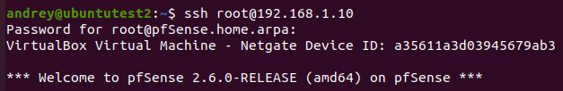
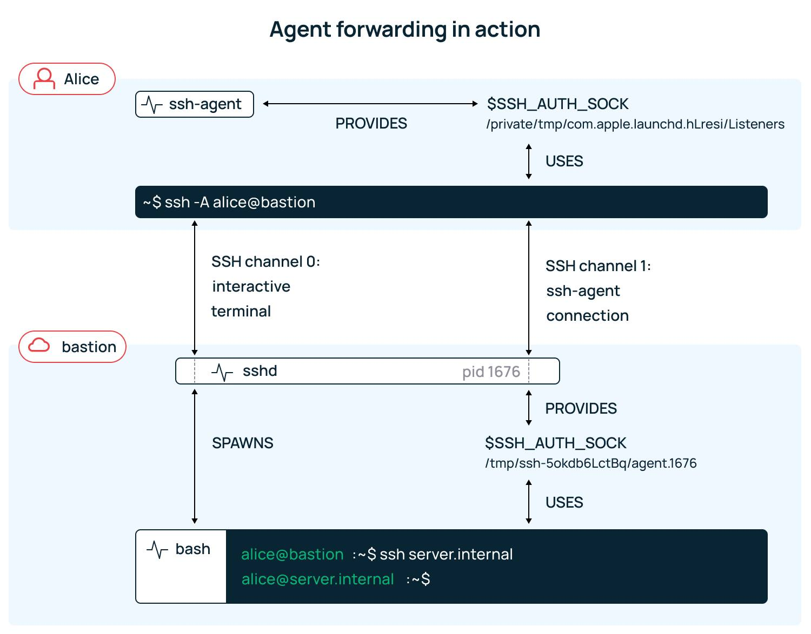
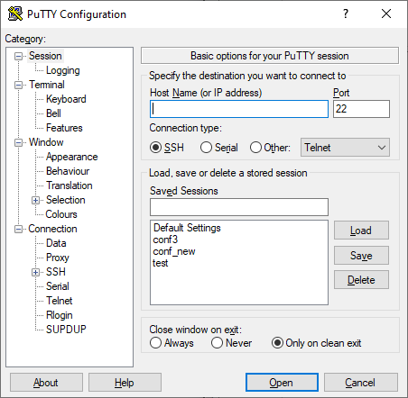
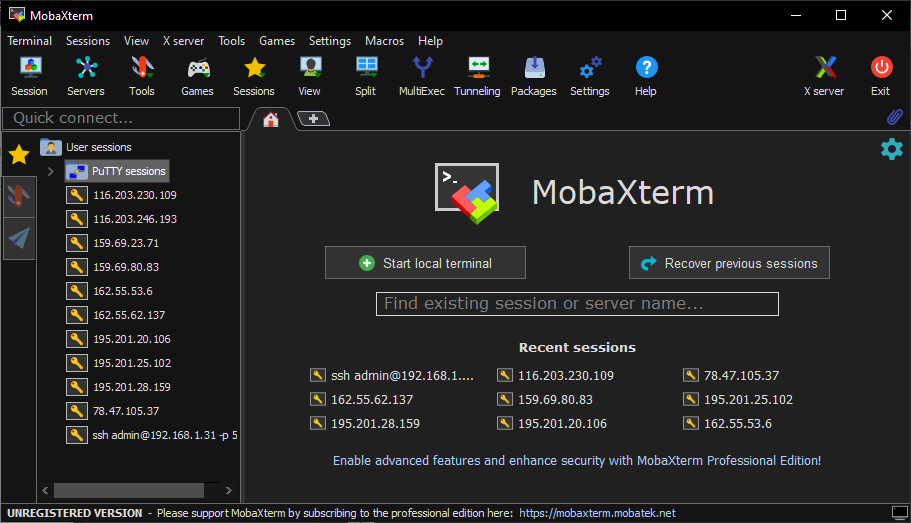
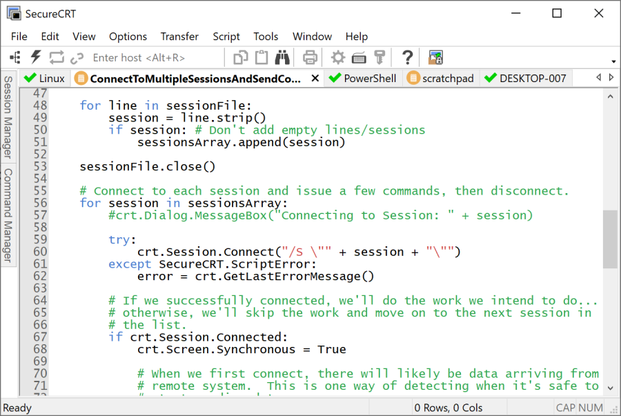

# SSH (Secure Shell)

Это сетевой протокол, позволяющий безопасно подключаться к удалённым компьютерам и управлять ими через командную строку. Он шифрует весь трафик (команды, пароли), заменяя небезопасные методы вроде Telnet, и работает по принципу клиент-сервер, обычно используя порт 22

## Теория

SSH обеспечивает безопасное соединение между клиентом и сервером, используя криптографические методы для защиты данных от перехвата и несанкционированного доступа. Он поддерживает аутентификацию пользователей с помощью паролей, ключей и других методов, а также позволяет выполнять удалённые команды и передавать файлы. SSH широко используется для администрирования серверов, удалённого доступа и безопасного обмена данными в сетях. Он также поддерживает туннелирование, позволяя безопасно передавать данные через незащищённые сети. Эта служба была создана в качестве замены не зашифрованному Telnet и использует криптографические техники, чтобы обеспечить, что всё сообщение между сервером и пользователем было зашифровано. 

#### Открытие транспортного канала

Первым шагом идет установка TCP-соединения. TCP использует сегменты для определения готовности узла-получателя к приему данных. 
Когда отправитель хочет установить соединение, TCP отправляет сегмент SYN протоколу на принимающем хосте. Принимающий TCP возвращает сегмент ACK, чтобы подтвердить успешное получение SYN. Отправляющий TCP отправляет еще один ACK, затем - переходит к отправке данных. Этот обмен управляющей информацией называется трехсторонним рукопожатием. После того, как соединение установилось, клиент-серверные устройства обмениваются данными о версиях протокола SSH и прочей информацией, которая определяет тип шифрования, метод обмена ключами, алгоритмы сжатия данных и т. д. 

#### Аутентификация

После производится выбор подходящего алгоритма - это можно посмотреть с использованием следующих команд:
- ssh -Q kex - используется, если нужно посмотреть алгоритмы обмена ключей со стороны клиента и выбрать нужный метод;
- ssh -Q cipher - используется для настройки списков алгоритмов шифрования на сервере;
- ssh -Q key-cert - используется, чтобы получить информацию о типах ключей для авторизации со стороны клиента.

Для обеспечения безопасности в протоколе SSH применяются ключи. Ключи делятся на два вида: 

- симметричные - для шифрования и дешифрования информации используется один и тот же ключ;
- асимметричные - для шифрования и дешифрования информации используются приватный (защищенный, для дешифрования) и публичный (незащищенный, передаваемый для шифрования) ключи. Первый хранится на устройстве, а второй распространяется между устройствами, с которыми устанавливается соединение. 

При одинаковой длине симметричного и асимметричного ключей криптостойкость первого будет выше криптостойкости второго. Это влияет на расходы при обмене информацией: снижение длины ключа ведет к снижению требований к оборудованию для шифрования. 

Поэтому при работе SSH-соединения взаимодействие происходит гибридно: асимметричный ключ используется для установки соединения, а симметричный ключ (его еще называют сеансовым) - для последующего шифрования данных. Сеансовый ключ можно менять во время или после передачи определенного количества трафика. Выбор сеансового ключа происходит следующим образом:

1) Сервер высылает свой публичный асимметричный ключ;
2) Клиент случайным образом выбирает сеансовый ключ;
3) Клиент шифрует сеансовый ключ с помощью публичного, который получен от сервера, и передает его на сервер;
4) С помощью приватного асимметричного ключа сервер расшифровывает сеансовый, который получен от пользователя;
5) Далее при обмене данными используется сеансовый ключ до момента его обновления, когда алгоритм повторяется заново.

#### Организация соединения SSH

При обмене данными по SSH-соединению, взаимодействующие стороны могут подвергнуться атаке злоумышленника, "атаке человека посередине". 

Злоумышленник знает о наличии SSH-соединения и может попытаться перехватить публичный асимметричный ключ сервера, чтобы заменить его на свой и передать пользователю. Тогда при верификации злоумышленник сможет выдавать себя и за клиента, и за сервер, а также дешифровать данные с помощью полученного сеансового ключа. 

Однако на практике подменить публичный ключ сервера невозможно, потому что каждый из ключей обладает своей уникальной контрольной суммой (отпечатком или "фингерпринтом"). Когда пользователь впервые подключается к SSH-серверу, он видит сообщение, содержащее данную комбинацию:


Если вы - администратор сервера, то в любой момент можете посмотреть данное значение. Ключи хранятся в каталоге по пути /etc/ssh/ - увидеть fingerprint можно с помощью следующей команды:

```
ssh-keygen -l -f ssh_host_ed25519_key
```


Ну и если отпечаток меняется - значит, сервер изменил ключ. Это может произойти при переустановке ssh или под действием атаки какой-то.

#### Установка соединения и аутентификация

В случае, когда пользователь успешно подключился к серверу, все равно лучше проверить его права доступа. Для этого предусмотрены два типа аутентификации - с помощью пароля и сертификата (по ключам).

Комбинация имени пользователя и пароля является наиболее популярным методом аутентификации на сервере SSH и по умолчанию находится во включенном состоянии.

Аутентификация по имени пользователя и паролю также является наиболее знакомым методом, поскольку он широко используется повсеместно. После ввода команды ssh система запросит пароль:

```
ssh name@ip_address 
```



Если человек не хочет использовать пароли, он может создать специальные пары ключей. Ключи SSH — это комбинация открытых и закрытых ключей, используемых во время процесса аутентификации([Как сгенерировать SSH-ключ для доступа на сервер](https://selectel.ru/blog/tutorials/how-to-generate-ssh/)). О том, как загрузить публичный ключ на сервер можно прочитать в [актуальной документации](https://docs.selectel.ru/dedicated/manage/create-and-place-ssh-key/).

#### Форвардинг или проброс ключей

Если нужно подключиться с управляемой машины на еще одно устройство, может быть использована технология проброса ключей. Ее используют, когда нужно избежать ситуации с хранением ключей на удаленной машине. Проброс ключей можно выполнить с помощью простой команды ssh с флагом -A:

```
ssh -A name@address
```

В этом случае механизм добавляет приватный ключ на сервер, а тот на второй сервер. Данное действие можно осуществить с помощью модификации конфига ssh, где надо дописать следующее:

```
Host
ForwardAgent yes
```

Это также позволит выполнить проброс ключа. Схема подключения будет выглядеть следующим образом:

```
Устройство 1: ssh root@ip_serv1
Сервер 1: ssh root@ip_serv2
```

#### SSH-agent

При работе с SSH пользователь может столкнуться с ситуацией, когда нужно ввести пароль несколько раз - например, при работе с несколькими хостами. Для упрощения этой операции существует специальное средство - SSH-агент. 

Большинство пользователей использует решение на базе OpenSSH, однако на рынке существуют и альтернативные варианты - например, Yubikeys и Sekey. SSH-агент отвечает за хранение паролей в памяти и предоставление услуг аутентификации для клиентов. Если агент предварительно загружен в систему, SSH-сессия не будет спрашивать пароль. Действие агента продолжается до тех пор, пока не будет завершена работа сервера. 



#### Решения для подключения по протоколу SSH

В интернете можно найти много различных программ, которые позволяют устанавливать SSH-соединения. Из них можно выделить следующие варианты:

- CMD, командная строка или терминал - это самый простой и уже встроенный в систему способ подключения к серверу. Для подключения через CMD достаточно набрать ssh <имя_пользователя>@<адрес_сервера>. Иногда нужно указать порт - можно сделать с помощью -p.


- Putty - это кроссплатформенное приложение для подключения к удаленным машинам. Среди его преимуществ - поддержка большинства протоколов, а также активная поддержка комьюнити.



- MobaXterm - это эмулятор терминала и многофункциональное приложение удаленного рабочего стола для Windows. В данном приложении возможно открыть множество терминалов в виде вкладок и разместить их на одном экране. При помощи него возможно подключаться по RDP, также подключаться к Linux-машинам с графической оболочкой (VNC), создавать макросы и многое другое.



- SecureCRT - это кроссплатформенное приложение для подключения к удаленным устройствам с возможностью задействования множества протоколов - например, SSH1, SSH2, Telnet, Telnet по SSL, Rlogin, Serial, TAPI. Также SecureCRT поддерживает написание макросов и сценариев, расширенные SSH-функции, включая public key assistant, X.509, поддержку смарт-карт и GSSAPI, X11 forwarding, туннелирование других протоколов.

