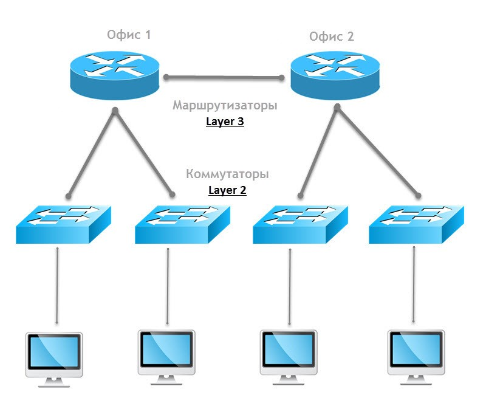
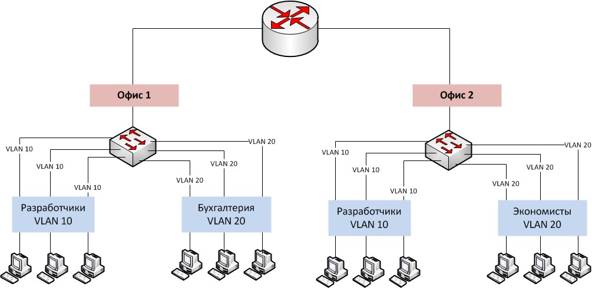
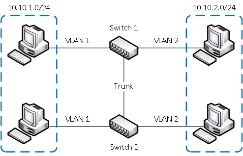
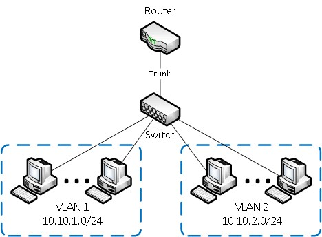
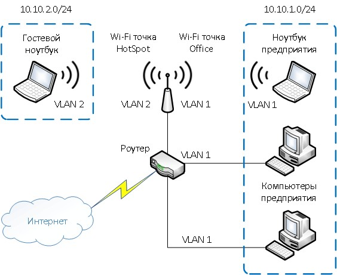
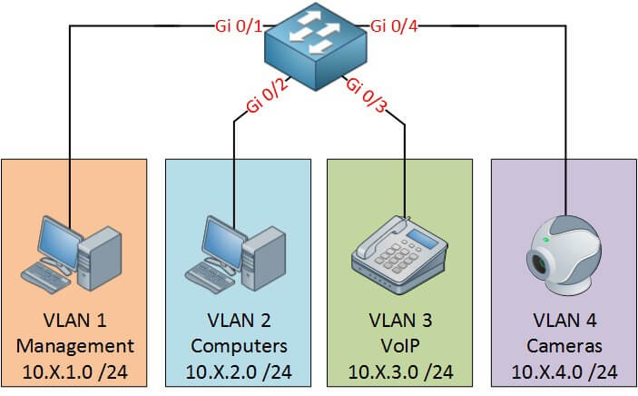

# VLAN (Virtual Local Area Network)

VLAN - это технология, которая позволяет строить виртуальные сети с независимой от физических устройств топологией. Например, можно объединить в одну сеть отдел компании, сотрудники которого работают в разных зданиях и подключены к разным коммутаторам. Или наоборот, создать отдельные сети для устройств, подключённых к одному коммутатору, если этого требует политика безопасности

## Теория

Компьютеры в локальной сети соединяются между собой с помощью сетевого оборудования - коммутаторов. По умолчанию все устройства, подключённые к портам одного коммутатора, могут взаимодействовать, обмениваясь сетевыми пакетами. Любой компьютер может направить широковещательный пакет, адресованный всем устройствам в этой сети, и все остальные компьютеры, подключённые к коммутатору, получат его. Все слышат всех

Большое количество широковещательных пакетов, отправляемых устройствами, приводит к снижению производительности сети, поскольку вместо полезных операций коммутаторы заняты обработкой данных, адресованных сразу всем

Чтобы снизить влияние широковещательных рассылок на производительность, сеть разделяют на изолированные сегменты. При этом каждый широковещательный пакет будет распространяться только в пределах сегмента, к которому подключен компьютер-отправитель

Добиться такого результата можно, подключив разные сегменты к разным физическим коммутаторам, не соединённым между собой, либо соединить их через маршрутизаторы, которые не пропускают широковещательные рассылки

На рисунке имеется четыре изолированных сегмента сети, каждый из которых подключён к отдельному физическому коммутатору. Взаимодействие между сегментами происходит через маршрутизаторы

VLANы позволяют изолировать сегменты сети с помощью одного физического коммутатора. При этом функционально всё будет выглядеть полностью аналогично, но для каждого офиса используется один коммутатор с поддержкой VLAN

В основе технологии VLAN лежит стандарт IEEE 802.1Q. Он позволяет добавлять в Ethernet-трафик информацию о принадлежности передаваемых данных к той или иной виртуальной сети - теги VLAN. С их помощью коммутаторы и маршрутизаторы могут выделить из общего потока передаваемых по сети кадров те, что относятся к конкретному сегменту

Технология VLAN даёт возможность организовать функциональный эквивалент нескольких LAN-сетей без использования набора из коммутаторов и кабелей, которые понадобились бы для их реализации в физическом виде. Физическое сетевое оборудование заменяется виртуальным. Отсюда термин Virtual LAN

Преимущества VLAN

- Сокращение числа широковещательных запросов, которые снижают пропускную способность сети.
- Повышение безопасности каждой виртуальной сети. Работники одного отдела офиса не смогут отслеживать трафик отделов, не входящих в их VLAN, и не получат доступ к их ресурсам.
- Возможность разделять или объединять отделы или пользователей, территориально удаленных друг от друга. Это позволяет привлекать к рабочему процессу специалистов, не находящихся в здании офиса.
- Создать новую виртуальную сеть можно без прокладки кабеля и покупки коммутатора.
- Позволяет объединить в одну сеть компьютеры, подключенные к разным коммутаторам.
- Упрощение сетевого администрирования. При переезде пользователя VLAN в другое помещение или здание сетевому администратору нет необходимости перекоммутировать кабели, достаточно со своего рабочего места перенастроить сетевое оборудование. А в случае использования динамических VLAN регистрация пользователя в "своём" VLAN на новом месте выполнится автоматически.

## Практика

Используя виртуальные локальные сети, можно создавать конфигурации для решения различных задач:

1) Объединить в единую сеть группы компьютеров, подключённых к разным коммутаторам:

Компьютеры в VLAN 1 будут взаимодействовать между собой, хотя подключены к разным физическим коммутаторам, при этом сети VLAN 1 и VLAN 2 будут невидимы друг для друга.

2) Разделить на разные сети компьютеры, подключённые к одному коммутатору

При этом устройства в VLAN 1 и VLAN 2 не смогут взаимодействовать между собой.

3) Разделить гостевую и корпоративную беспроводную сеть компании:

Гости смогут подключаться к интернету, но не получат доступа к сети компании.

4) Обеспечить взаимодействие территориально распределённых отделов компании как единого целого:

