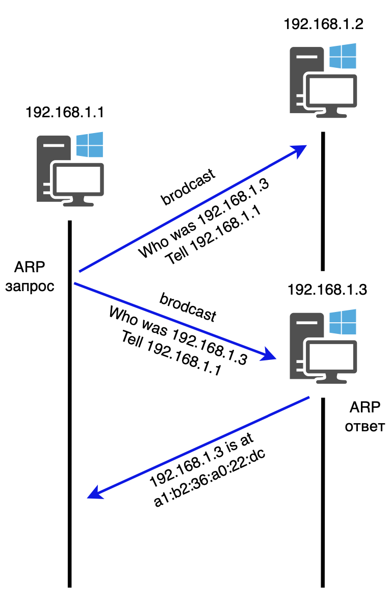

# ARP (Address Resolution Protocol)

Это фундаментальный сетевой протокол, который связывает логические IP-адреса (сетевой уровень) с физическими MAC-адресами (канальный уровень) внутри локальной сети. То есть компьютеру нужно отправить данные на другой узел. Он знает IP-адрес, но для отправки пакета по кабелю (или Wi-Fi) ему нужен MAC-адрес (уникальный физический идентификатор). Устройство рассылает широковещательный запрос по всей сети типа, "У кого IP-адрес 192.168.1.5? Сообщите свой MAC-адрес!". Устройство, чей это IP, откликается и отправляет свой MAC-адрес. Чтобы не делать этот запрос постоянно, компьютер сохраняет полученную пару "IP — MAC" в свою ARP-таблицу. 

## Теория

Короче, адресация в сети Internet представляет собой 32-битовую последовательность 0 и 1, называющихся IP-адресами. Но связь между двумя устройствами в сети осуществляется по адресам канального уровня (MAC-адресам).

Так вот, для определения соответствия между логическим адресом сетевого уровня (IP) и физическим адресом устройства (MAC) используется описанный в RFC 826 протокол ARP (Address Resolution Protocol, протокол разрешения адресов).

ARP состоит из двух частей. Первая – определяет физический адрес при посылке пакета, вторая – отвечает на запросы других станций.

Протокол имеет буферную память (ARP-таблицу), в которой хранятся пары адресов (IP-адрес, MAC-адрес) с целью уменьшения количества посылаемых запросов, следовательно, экономии трафика и ресурсов.

Они выглядят примерно так: 
```
192.168.1.1 08:10:29:00:2F:C3
192.168.1.2 08:30:39:00:2F:C4
```

Слева – IP-адреса, справа – MAC-адреса.

Прежде, чем подключиться к одному из устройств, IP-протокол проверяет, есть ли в его ARP-таблице запись о соответствующем устройстве. Если такая запись имеется, то происходит непосредственно подключение и передача пакетов. Если же нет, то посылается широковещательный ARP-запрос, который выясняет, какому из устройств принадлежит IP-адрес. Идентифицировав себя, устройство посылает в ответ свой MAC-адрес, а в ARP-таблицу отправителя заносится соответствующая запись.

Записи ARP-таблицы бывают двух вид видов: статические и динамические. Статические добавляются самим пользователем, динамические же – создаются и удаляются автоматически. При этом в ARP-таблице всегда хранится широковещательный физический адрес FF:FF:FF:FF:FF:FF (в Linux и Windows).

Создать запись в ARP-таблице просто (через командную строку): 
```
arp –s <IP-адрес> <MAC-адрес>    
```

Вывести записи ARP-таблицы: 
```
arp –a
```

После добавления записи в таблицу ей присваивается таймер. При этом, если запись не используется первые 2 минуты, то удаляется, а если используется, то время ее жизни продлевается еще на 2 минуты, при этом максимально – 10 минут для Windows и Linux (FreeBSD – 20 минут, Cisco IOS – 4 часа), после чего производится новый широковещательный ARP-запрос.

> Сообщения ARP не имеют фиксированного формата заголовка и при передаче по сети инкапсулируются в поле данных канального уровня!!!

Формат сообщения ARP:



- тип сети (16 бит): для Ethernet – 1;
- тип протокола (16 бит): h0800 для IP;
- длина аппаратного адреса (8 бит);
- длина сетевого адреса (8 бит);
- тип операции (16 бит): 1 – запрос, 2 – ответ;
- аппаратный адрес отправителя (переменная длина);
- сетевой адрес отправителя (переменная длина);
- аппаратный адрес получателя (переменная длина);
- сетевой адрес получателя (переменная длина).

## Практика

Пусть отправитель A и получатель B имеют свои адреса с указанием маски подсети.

1) Если адреса находятся в одной подсети, то вызывается протокол ARP и определяется физический адрес получателя, после чего IP-пакет собирается воедино в кадр канального уровня и отправляется по указанному физическому адресу, соответствующему IP-адресу назначения.
2) Если нет – начинается просмотр таблицы в поисках прямого маршрута.
3) Если маршрут найден, то вызывается протокол ARP и определяется физический адрес соответствующего маршрутизатора, после чего пакет собирается воедино в кадр канального уровня и отправляется по указанному физическому адресу.
4) В противном случае, вызывается протокол ARP и определяется физический адрес маршрутизатора по умолчанию, после чего пакет собирается воедино в кадр канального уровня и отправляется по указанному физическому адресу.

Главным достоинством проткола ARP является его простота, ну а недостаток – абсолютная незащищенность, так как протокол не проверяет подлинность пакетов, и, в результате, можно осуществить подмену записей в ARP-таблице, вклинившись между отправителем и получателем.

Бороться с этим недостатком можно, вручную вбивая записи в ARP-таблицу, что добавляет много рутинной работы как при формировании таблицы, так и последующем ее сопровождении в ходе модификации сети.

Существуют еще протоколы InARP (Inverse ARP), который выполняет обратную функцую: по заданному физическому адресу ищется логический получателя, и RARP (Reverse ARP), который схож с InARP, только он ищет логический адрес отправителя.

В целом, протокол ARP универсален для любых сетей, но используется только в IP и широковещательных (Ethernet, WiFi, WiMax и так далее) сетях, как наиболее широко распространенных, что делает его незаменимым при поиске соответствий между логическими и физическими адресами.