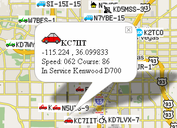
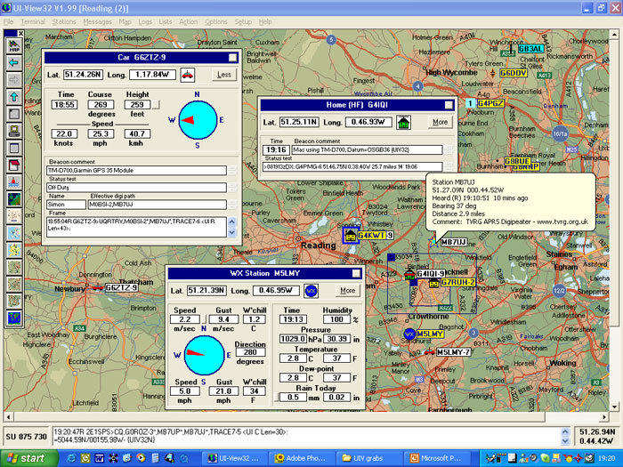
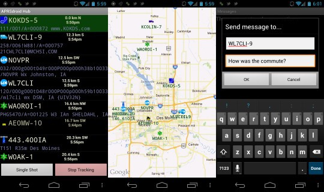

ARPS (Automatic Packet Reporting System)

Это протокол цифровой радиолюбительской связи. На базе этого протокола построена глобальная система связи. Её основные задачи: передача информации о координатах объектов в пространстве, обмен сообщениями, передача данных с погодных станций и многое другое

## Теория

По сути дела это стандарт, описывающий типы и форматы сообщений, которые могут передаваться по сети. Формат пакета может немного отличаться в зависимости от среды передачи, но содержимое и назначение пакета от этого не меняются.

К примеру у нас есть, 

1) Маяк (Beacon) - самое часто используемое сообщение. Оно содержит в себе позывной станции, его координаты и короткий комментарий
2) Короткое текстовое сообщение (Message) - аналог СМС, содержит позывной получателя, отправителя и текст короткого сообщения
3) Пакет от погодной станции (WX) - содержит информацию о метеорологических условиях в данной точке (температура, давление, влажность, сила и направление ветра)
4) Другие типы сообщений



Как выглядит сам пакет этого ARPS стандарта:

```c
struct arps {
    byte flag[1];
    byte address_where_to_send[7];
    byte address_from[7];
    byte digipeater[56];
    byte control[1];
    byte identifier[1];
}
```

> Все текстовые адреса (позывные) в радиоэфире кодируются со сдвигом бит на 1 влево, поэтому в обычном HEX-редакторе они выглядят искаженными.

Насчёт того, что у нас внутри пакета - в зависимости от первого символа после двоеточия (:), пакет APRS может нести разную информацию:

- Координаты: !5545.12N/03737.30E# (Без времени) или @092345z5545.12N/03737.30E# (Со временем передачи).    
• Текстовое сообщение (Status): >Привет всем на частоте! (Начинается с >).   
- Личное сообщение (Message): :R1AAA    :Привет, как слышно?01 (Адресовано конкретному позывному R1AAA).   
- Погодная станция (Weather): !5545.12N/03737.30E_220/004g005t077... (Передает направление/скорость ветра, температуру, влажность).   
- Телеметрия: T#001,012,000,023,105,00000011 (Данные о напряжении аккумулятора, температуре процессора и т.д.).

Получается, что сырой пакет выглядит вот так:

```
RA3ABC-9>APRS,WIDE1-1,WIDE2-1:=5545.12N/03737.30E>220/045/My APRS Station
```

То есть:

1) Адрес отправителя (RA3ABC-9) - позывной сигнал радиолюбителя с интификатором SSID. Номер указывает на тип станции (например, -9 означает тактический мобильный объект или автомобиль).
2) Адрес назначения (>APRS) - часто это просто флаг (APRS, APDI01, APRSFI), указывающий программному обеспечению, как интерпретировать данные, или определяющий тип используемого оборудования.
3) Путь маршрутизации (WIDE1-1,WIDE2-1) - инструкции для ретрансляторов (дипитеров). Данная комбинация говорит о том, что пакет должен быть передан в эфир сначала ближайшими локальными станциями, а затем более мощными узлами регионального покрытия.
4) Тип данных (:) - двоеточие разделяет заголовок и полезную нагрузку. Следом идущий символ равенства (=) означает, что пакет содержит информацию о местоположении (координаты) без отметки времени.
5) Координаты (5545.12N/03737.30E) - широта и долгота объекта в специальном сжатом текстовом формате.
6) Символ иконки (/ и >) - комбинация этих символов сообщает картам APRS-IS, какую иконку отображать на карте (например, машинку, дом, самолет или пешехода).
7) Телеметрия курса/скорости (220/045) - направление движения (220 градусов) и скорость (45 узлов или км/ч, в зависимости от настроек).
8) Текстовый комментарий (/My APRS Station) - произвольное текстовое сообщение, статус или частота, на которой радиолюбитель готов выйти на голосовую связь.

Теперь перейдём к частям сети. В первую очередь это станции (подвижные и стационарные), еще есть объекты. В сеть передается позывной сигнал (Callsign) и координаты (QTH) станции или объекта. Дополнительно передается значок, определяющий назначение станции (автомобиль, автобус, дом и прочая хуйня) и короткий текстовый комментарий. К примеру, я хочу знать, где сейчас находится мой автомобиль. Сеть как раз и выполняет функцию передачи информации о координатах станции и других его параметрах всем заинтересованным. Как правило, станции отображаются на карте по переданным координатам. Другая станция, являясь полноценным участником сети, может отправить текстовое сообщение другой станции. Например, диспетчер такси по карте видит авто, которые ближе всех к нужному месту и отправляет текстовое сообщение с адресом, куда ехать. 

В идеальном случае пакеты от станции должны попасть в глобальную сеть Интернет. После этого любой подключенный к сети Интернет сможет получить информацию о станции. Для этого существуют мировые APRS серверы. Благодаря интернету, разрозненные части радиосети объединяются в одну мировую сеть APRS (и станции могут связаться между собой).

Самый простой вариант, когда станция имеет прямое подключение к сети Интернет (например программа на смартфоне + GPS + мобильный интернет, либо программа на стационарном компьютере + подключение к интернет). В этом случае выполняется прямое подключение к APRS серверу и программа ведет прямой прием и отправку сообщений в мировую сеть APRS.

Но даже без интернета хорошо развитая радиосеть APRS подразумевает наличие сети класс станций - радиоретрансляторов (пакетные ретрансляторы - диджипитеры (DIGI)). Эти станции стоят высоко, слышат далеко и принимают сигналы мобильных радиостанций с подвижных объектов, которые, как правило работают на УКВ (ультра короткие волны). После приема APRS сообщения DIGI его ретранслирует. Кроме ретрансляторов есть еще класс станций - мосты (GATE) они могут переслать пакет с одного диапазона на другой. Например, если у GATE есть два трансивера на разные диапазоны, то он может передать пакет с одного диапазона на другой. Дальность связи на УКВ может достигать 50км и GATE приняв пакет на УКВ может передать его на КВ, где пакет может быть передан уже на сотни километров. Тем самым пакет "долетит" до другого города. И если бы существовала сеть, которая покрывала все нужные территории с помощью DIGI и соединяла бы их между собой, то в Интернете отпала бы необходимость. Но хуй такое будет. Поэтому есть еще один класс станций - гейты, которые подключены к сети Интернет - IGATE. Именно через них пакеты из радио эфира попадают в мировую сеть APRS.

## Практика



---

1.1 Портативный ПК с подключением к Интернет, без радио, c GPS

Оборудование:

(М) Портативный компьютер.           
(+) Подключен GPS приемник         
(+) Подключен к сети Интернет (Wi-Fi, 3G, 4G, LTE, 5G).


> В такой конфигурации ваши координаты смогут автоматически меняться во времени и другие участники сети APRS смогут увидеть ваши передвижения.

---

1.2 Портативный ПК без подключения к Интернет, с трансивером, c GPS

Оборудование:

    (М) Портативный компьютер.                    
    (+) Подключен GPS приемник.                    
    (+) Подключен трансивер.


> В такой конфигурации ваши координаты смогут автоматически меняться во времени и информация об этом будет передаваться в радио эфир. Если ваши пакеты будут приняты по радио другими участники сети APRS, то они смогут увидеть эту информацию. Если пакеты будут приняты станцией, подключенной к мировой сети APRS (IGATE), то информацию смогут увидеть все.

--- 

1.3 Стационарный ПК с подключением к Интернет, с трансивером

Оборудование:

    (+) Подключен трансивер.

> В такой конфигурации станция может принимать, отправлять и обрабатывать пакеты как из мировой сети APRS, так и из радио эфира, в пределах своей зоны радиовидимости. Такая станция может работать, как IGATE (отправлять принятые пакеты из радио эфира в мировую сеть APRS). 

--- 

1.4 Стационарный ПК без подключения к Интернет, с трансивером

Оборудование:

    (+) Подключен трансивер.
    (-) Отсутствует Интернет.


> В такой конфигурации станция может принимать, отправлять и обрабатывать пакеты из радио эфира, в пределах своей зоны радиовидимости. Такая станция может работать, как DIGI (ретранслировать пакеты, принятые из радио эфира). Если в пределах радиовидимости этой станции находится IGATE, то ее пакеты могут попасть в мировую сеть APRS (к примеру, можно воспользоваться сервисом отправки текстового сообщения на EMAIL в сети Интернет, находясь в каком-нибудь глубоком лесу или в море).

--- 

1.4 Стационарный ПК с подключением к Интернет, с приемником

Оборудование:

    (+) Подключен приемник.


> В такой конфигурации станция может работать, как IGATE, выполняя эту важную функцию. Если постараться, то можно обойтись даже не любительским приемником, а USB донглом с SDR технологией и правильно соединить между собой все программы.

---

2) Смартфон

Оборудование:

    Смартфон.


Программное обеспечение:

    Клиент APRS — APRSdroid


> В такой конфигурации станция всегда в кармане, а на карте можно отображаться, как человек (а не авто).



--- 

3) APRS трекер

Да да, это именно то, что продается под названием "спутниковая сигнализация". Трекер - автоматическое устройство, которое либо просто записывает координаты и время, либо плюс к этому может передавать маяки в эфир. Взаимодействие с пользователем в процессе работы не предполагается. Трекеры ставят в машины, запускают на воздушных шарах.

---

4) КПК с Windows Mobile

    Существует клиент для КПК - APRS/CE.

Если хочется почитать больше то вот прикольная [статья](https://habr.com/ru/articles/249901/)