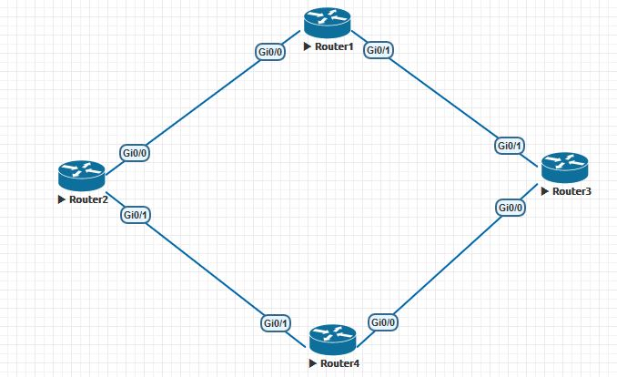

BGP (Border Gateway Protocol)

BGP - это протокол динамической маршрутизации, являющийся единственным EGP( External Gateway Protocol) протоколом. Данный протокол используется для построения маршрутизации в интернете. BGP позволяет автономным системам (AS) обмениваться информацией о маршрутах и выбирать оптимальные пути для передачи данных между ними. 

## Теория 

## Пример 

Рассмотрим как строится соседство между двумя маршрутизаторами BGP:



Рассмотрим соседство между Router1 и Router3. Настроим их при помощи следующих команд:

```
router bgp 10
  network 192.168.12.0
  network 192.168.13.0
  neighbor 192.168.13.3 remote-as 10

router bgp 10
  network 192.168.13.0
  network 192.168.24.0
  neighbor 192.168.13.1 remote-as 10
```

