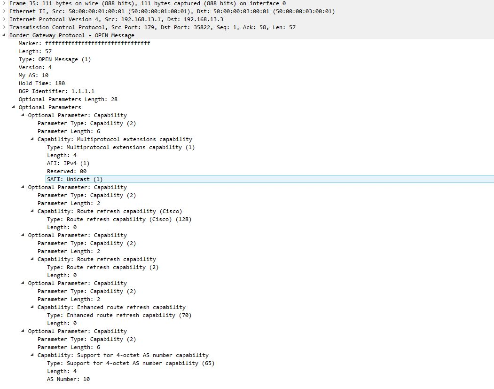

BGP (Border Gateway Protocol)

BGP - это протокол динамической маршрутизации, являющийся единственным EGP( External Gateway Protocol) протоколом. Данный протокол используется для построения маршрутизации в интернете. BGP позволяет автономным системам (AS) обмениваться информацией о маршрутах и выбирать оптимальные пути для передачи данных между ними. 

## Теория 

## Пример 

Рассмотрим как строится соседство между двумя маршрутизаторами BGP:


Рассмотрим соседство между Router1 и Router3. Настроим их при помощи следующих команд:

```
router bgp 10
  network 192.168.12.0
  network 192.168.13.0
  neighbor 192.168.13.3 remote-as 10

router bgp 10
  network 192.168.13.0
  network 192.168.24.0
  neighbor 192.168.13.1 remote-as 10
```

Соседство внутри одной автономной системы - AS 10. После ввода данных на маршрутизаторе, например на Router1, данный маршрутизатор пытается настроить отношения соседства с маршрутизатором Router3. Начальное состояние, когда ничего не происходит называется Idle. Как только будет настроен bgp на Router1, он начнет слушать TCP порт 179 - перейдет в состояние Connect, а когда пытается открыть сессию с Router3, то перейдет в состояние Active.

После того, как сессия установится между Router1 и Router3, то происходит обмен Open сообщениями. Когда данное сообщение отправит Router1, то данное состояние будет называться Open Sent. А когда получит Open сообщение от Router3, то перейдет в состояние Open Confirm. Рассмотрим более подробно сообщение Open:



В данном сообщение передается информация о самом протоколе BGP, который использует маршрутизатор. Обмениваясь Open сообщениями, Router1 и Router3 сообщают друг другу информацию о своих настройках. Передаются следующие параметры:

1) Version (Версия): а именно версия протокола BGP, которую использует маршрутизатор. В данном случае версия 4, она описана в стандарте RFC 4271. Два маршрутизатора BGP будут пытаться согласовать совместимую версию, и если будет несоответствие, то сессия BGP не будет установлена

2) My AS (Моя AS): номер автономной системы, к которой принадлежит маршрутизатор. В данном случае AS 10. Этот параметр используется для идентификации автономной системы, и он важен для установления соседства между маршрутизаторами BGP. Если два маршрутизатора BGP принадлежат к разным автономным системам, то они не смогут установить соседство. К примеру есть internal BGP (iBGP) - это когда маршрутизаторы принадлежат к одной автономной системе, и External BGP (eBGP) - это когда маршрутизаторы принадлежат к разным автономным системам. В нашем примере Router1 и Router3 принадлежат к одной автономной системе AS 10, поэтому они могут установить соседство

3) Hold Time (Время удержания): это время, в течение которого маршрутизатор будет считать соседство активным, если не получит никаких сообщений от соседа. Если маршрутизатор не получает сообщений от соседа в течение этого времени, он считает соседство неактивным и удаляет его из своей таблицы маршрутизации. В нашем примере Hold Time составляет 180 секунд. Обычно время ожидания 180 секунд, и каждые 60 секунд маршрутизаторы BGP отправляют Keepalive сообщения, чтобы поддерживать соседство активным. И оба роутера должны согласовать значение Hold Time, и если они не совпадают, то сессия BGP не будет установлена