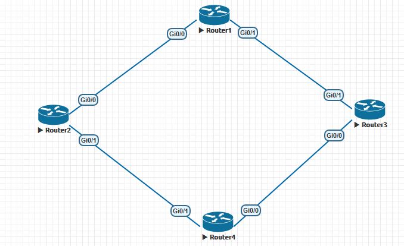
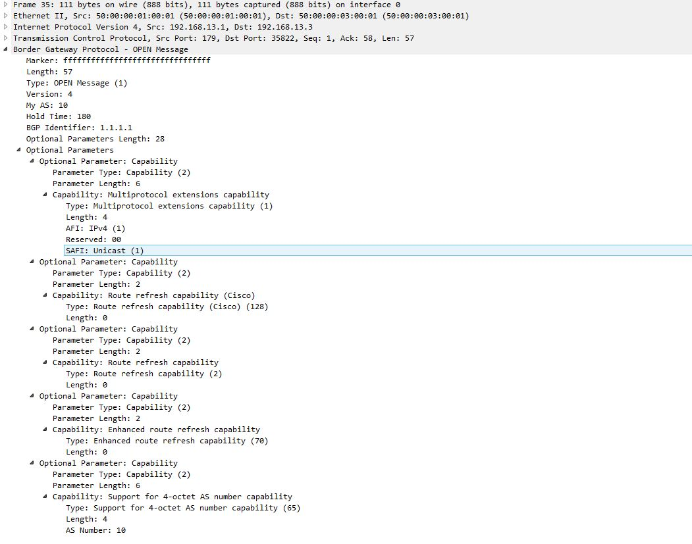
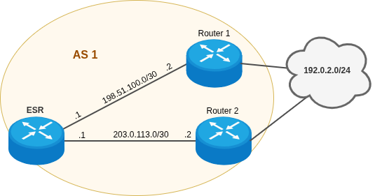

BGP (Border Gateway Protocol)

BGP - это протокол динамической маршрутизации, являющийся единственным EGP( External Gateway Protocol) протоколом. Данный протокол используется для построения маршрутизации в интернете. BGP позволяет автономным системам (AS) обмениваться информацией о маршрутах и выбирать оптимальные пути для передачи данных между ними. 

## Теория 

## Пример 

Рассмотрим как строится соседство между двумя маршрутизаторами BGP:



Рассмотрим соседство между Router1 и Router3. Настроим их при помощи следующих команд:

```
router bgp 10
  network 192.168.12.0
  network 192.168.13.0
  neighbor 192.168.13.3 remote-as 10

router bgp 10
  network 192.168.13.0
  network 192.168.24.0
  neighbor 192.168.13.1 remote-as 10
```

Соседство внутри одной автономной системы - AS 10. После ввода данных на маршрутизаторе, например на Router1, данный маршрутизатор пытается настроить отношения соседства с маршрутизатором Router3. Начальное состояние, когда ничего не происходит называется Idle. Как только будет настроен bgp на Router1, он начнет слушать TCP порт 179 - перейдет в состояние Connect, а когда пытается открыть сессию с Router3, то перейдет в состояние Active.

После того, как сессия установится между Router1 и Router3, то происходит обмен Open сообщениями. Когда данное сообщение отправит Router1, то данное состояние будет называться Open Sent. А когда получит Open сообщение от Router3, то перейдет в состояние Open Confirm. Рассмотрим более подробно сообщение Open:



В данном сообщение передается информация о самом протоколе BGP, который использует маршрутизатор. Обмениваясь Open сообщениями, Router1 и Router3 сообщают друг другу информацию о своих настройках. Передаются следующие параметры:

1) Version (Версия): а именно версия протокола BGP, которую использует маршрутизатор. В данном случае версия 4, она описана в стандарте RFC 4271. Два маршрутизатора BGP будут пытаться согласовать совместимую версию, и если будет несоответствие, то сессия BGP не будет установлена

2) My AS (Моя AS): номер автономной системы, к которой принадлежит маршрутизатор. В данном случае AS 10. Этот параметр используется для идентификации автономной системы, и он важен для установления соседства между маршрутизаторами BGP. Если два маршрутизатора BGP принадлежат к разным автономным системам, то они не смогут установить соседство. К примеру есть internal BGP (iBGP) - это когда маршрутизаторы принадлежат к одной автономной системе, и External BGP (eBGP) - это когда маршрутизаторы принадлежат к разным автономным системам. В нашем примере Router1 и Router3 принадлежат к одной автономной системе AS 10, поэтому они могут установить соседство

3) Hold Time (Время удержания): это время, в течение которого маршрутизатор будет считать соседство активным, если не получит никаких сообщений от соседа. Если маршрутизатор не получает сообщений от соседа в течение этого времени, он считает соседство неактивным и удаляет его из своей таблицы маршрутизации. В нашем примере Hold Time составляет 180 секунд. Обычно время ожидания 180 секунд, и каждые 60 секунд маршрутизаторы BGP отправляют Keepalive сообщения, чтобы поддерживать соседство активным. И оба роутера должны согласовать значение Hold Time, и если они не совпадают, то сессия BGP не будет установлена

Пример настройки multipath маршрутов для BGP:



Настроить ECMP с ограничением до 2 multipath маршрутов. В исходной схеме  маршрутизаторы ESR, Router 1 и Router 2 находятся в одной AS 1.  От маршрутизаторов Router 1 и Router 2 анонсируется маршрут до подсети 192.0.2.0/24 с одинаковым cost на маршрутизатор ESR:

```
ESR# show bgp ipv4 unicast
Status codes: u - unicast, b - broadcast, m - multicast, a - anycast
              * - valid, > - best
Origin codes: i - IGP, e - EGP, ? - incomplete
 
     Network              Next Hop             Metric  LocPrf      Weight Path       
*> u 192.0.2.0/24         198.51.100.2         --      100         0      i
*  u 192.0.2.0/24         203.0.113.2          --      100         0      i
```

Поскольку multipath для BGP по умолчанию выключен (maximum-paths = 1), то в таблице маршрутизации будет 1 наилучший маршрут до подсети 192.0.2.0/24:

```
ESR# show ip route
 Codes: C - connected, S - static, R - RIP derived,
        O - OSPF derived, IA - OSPF inter area route,
        E1 - OSPF external type 1 route, E2 - OSPF external type 2 route
        B - BGP derived, D - DHCP derived, K - kernel route, V - VRRP route
        i - IS-IS, L1 - IS-IS level-1, L2 - IS-IS level-2, ia - IS-IS inter area
        * - FIB route
 
B     * 192.0.2.0/24       [170/0]           via 198.51.100.2 on gi1/0/1       [bgp1 04:03:09] (i)
C     * 198.51.100.0/30    [0/0]             dev gi1/0/1                       [direct 02:40:37]
C     * 203.0.113.0/30     [0/0]             dev gi1/0/2                       [direct 04:00:27]
```

Конфигурация маршрутизатора с выключенным firewall:

```
ESR# show running-config
router bgp log-neighbor-changes
router bgp 1
  router-id 198.51.100.1
  neighbor 198.51.100.2
    remote-as 1
    address-family ipv4 unicast
      enable
    exit
    enable
  exit
  neighbor 203.0.113.2
    remote-as 1
    address-family ipv4 unicast
      enable
    exit
    enable
  exit
  enable
exit
 
interface gigabitethernet 1/0/1
  ip firewall disable
  ip address 198.51.100.1/30
exit
interface gigabitethernet 1/0/2
  ip firewall disable
  ip address 203.0.113.1/30
exit
```

Для решения поставленной задачи необходимо настроить maximum-paths, равный 2, для всех BGP-процессов. Произведем необходимые изменения в конфигурации:

```
ESR# configure
ESR(config)# router bgp maximum-paths 2
ESR(config)# do commit
ESR(config)# do confirm
ESR(config)# exit
```