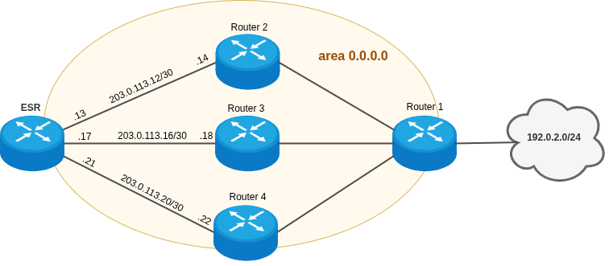

ECMP (Equal-Cost Multi-Path)

ECMP - это метод маршрутизации в компьютерных сетях, позволяющий отправлять пакеты данных, идущие к одному и тому же получателю, по нескольким разным каналам с одинаковой стоимостью (метрикой). Это позволяет эффективно балансировать нагрузку и увеличивать общую пропускную способность сети, задействуя все доступные пути, а не только один главный маршрут

## Теория 

## Практика 

ECMP поддержан для протоколов маршрутизации OSPF и BGP.  По умолчанию для OSPF количество multipath маршрутов - 16, для BGP количество multipath маршрутов - 1.

> С версии ПО 1.34.6 поддержан настройка статического multipath маршрута. Максимальное количество next-hop для статического multipath маршрута - 10.

Для изменения количества next-hop multipath маршрутов для OSPF необходимо указать maximum-paths при настройке OSPF-процесса. Пример:

```
ESR# configure
ESR(config)# router ospf 1
ESR(config-ospf)# maximum-paths ?
  1-32  Number of paths
```

ECMP настраивается глобально для всех IBGP-процессов и EBGP-процессов. Для изменения количества next-hop multipath маршрутов необходимо использовать следующую команду:

```
ESR(config)# router bgp maximum-paths ?
  1-16  Number of paths
```

Если лимит next-hop multipath маршрута исчерпан, то остальные ECMP маршруты не отображаются в таблице маршрутизации FIB. Пример отображения multipath маршрутов в таблице маршрутизации для OSPF:

```
ESR# show ip route
 Codes: C - connected, S - static, R - RIP derived,
        O - OSPF derived, IA - OSPF inter area route,
        E1 - OSPF external type 1 route, E2 - OSPF external type 2 route
        B - BGP derived, D - DHCP derived, K - kernel route, V - VRRP route
        i - IS-IS, L1 - IS-IS level-1, L2 - IS-IS level-2, ia - IS-IS inter area
        * - FIB route
 
O     * 192.0.2.1/32       [150/30]          multipath                         [ospf1 01:10:43]  (1.1.1.1)
                                   via 198.51.100.2 on gi1/0/1.2 weight 1
                                   via 198.51.100.6 on gi1/0/1.3 weight 1
                                   via 198.51.100.10 on gi1/0/1.4 weight 1
                                   via 198.51.100.14 on gi1/0/1.5 weight 1
                                   via 198.51.100.18 on gi1/0/1.6 weight 1
                                   via 198.51.100.22 on gi1/0/1.7 weight 1
```

#### Пример ограничения multipath маршрутов для OSPF



На маршрутизаторе ESR необходимо ограничить количество multipath маршрутов до 2-х.

В исходной схеме от маршрутизаторов Router 2, Router 3, Router 4  анонсируется маршрут до подсети 192.0.2.0/24 с одинаковым cost на маршрутизатор ESR. По умолчанию для OSPF включено 16 multipath маршрутов. В результате чего в таблице маршрутизации есть 3 multipath маршрута: 

```
ESR# show ip route
 Codes: C - connected, S - static, R - RIP derived,
        O - OSPF derived, IA - OSPF inter area route,
        E1 - OSPF external type 1 route, E2 - OSPF external type 2 route
        B - BGP derived, D - DHCP derived, K - kernel route, V - VRRP route
        i - IS-IS, L1 - IS-IS level-1, L2 - IS-IS level-2, ia - IS-IS inter area
        * - FIB route
 
O     * 192.0.2.0/24       [150/30]          multipath                         [ospf1 02:33:15]  (1.1.1.1)
                                   via 203.0.113.14 on gi1/0/1.10 weight 1
                                   via 203.0.113.18 on gi1/0/1.20 weight 1
                                   via 203.0.113.22 on gi1/0/1.30 weight 1
```

Конфигурация маршрутизатора ESR с выключенным firewall:

```
ESR# show running-config
router ospf log-adjacency-changes
router ospf 1
  router-id 203.0.113.1
  area 0.0.0.0
    enable
  exit
  enable
exit
 
interface gigabitethernet 1/0/1.10
  ip firewall disable
  ip address 203.0.113.13/30
  ip ospf instance 1
  ip ospf
exit
interface gigabitethernet 1/0/1.20
  ip firewall disable
  ip address 203.0.113.17/30
  ip ospf instance 1
  ip ospf
exit
interface gigabitethernet 1/0/1.30
  ip firewall disable
  ip address 203.0.113.21/30
  ip ospf instance 1
  ip ospf
exit
```

Для решения поставленной задачи необходимо указать maximum-paths, равный 2, при настройке OSPF-процесса. Произведем необходимые изменения в конфигурации:

```
ESR# configure
ESR(config)# router ospf 1
ESR(config-ospf)# maximum-paths 2
ESR(config-ospf)# do commit
ESR(config-ospf)# do confirm
ESR(config-ospf)# end
```

В результате в таблице маршрутизации будут 2 multipath маршрута:

```
ESR# show ip route
 Codes: C - connected, S - static, R - RIP derived,
        O - OSPF derived, IA - OSPF inter area route,
        E1 - OSPF external type 1 route, E2 - OSPF external type 2 route
        B - BGP derived, D - DHCP derived, K - kernel route, V - VRRP route
        i - IS-IS, L1 - IS-IS level-1, L2 - IS-IS level-2, ia - IS-IS inter area
        * - FIB route
 
O     * 192.0.2.0/24       [150/30]          multipath                         [ospf1 02:37:32]  (1.1.1.1)
                                   via 203.0.113.14 on gi1/0/1.10 weight 1
                                   via 203.0.113.18 on gi1/0/1.20 weight 1
```