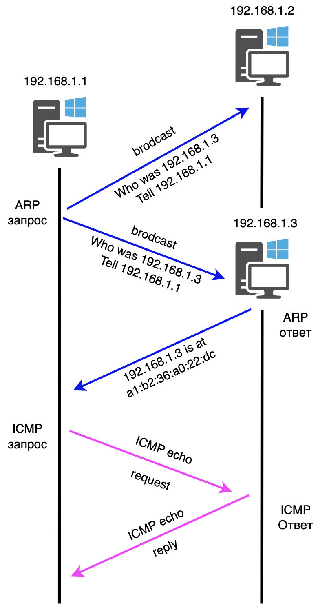
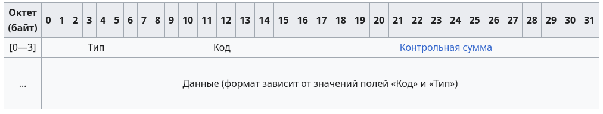

# ICMP (Internet Control Message Protocol) 

ICMP это служебный сетевой протокол, который работает на сетевом уровне и используется устройствами (например, маршрутизаторами) для отправки сообщений об ошибках и диагностической информации. В отличие от протоколов вроде TCP или UDP, ICMP не используется для обмена пользовательскими данными. Его главная цель - сообщать о состоянии сети.

> Для примера, самый известный пример использования ICMP - утилита Ping. Она отправляет эхо-запросы и принимает эхо-ответы, чтобы проверить, доступен ли удаленный компьютер, и измерить время задержки

## Теория

Заголовок ICMP идет после заголовка IPv4 и идентифицируется как протокол 1. ICMP-пакеты содержат 8-битный заголовок и данные переменного размера. Поле Type указывает на тип пакета. Если значение равно 8 это запрос ICMP echo (ping), если 0 - ответ ICMP echo (ping).

То есть как видим на фото, после того, как мы прогнали ARP протокол, мы получили MAC-адрес, и теперь можем отправить ICMP-пакет, который будет пересобран в IP-пакет, который в свою очередь будет пересобран в кадр канального уровня и отправлен по сети. При этом, если в процессе передачи возникнут какие-либо проблемы, например, если маршрутизатор не может доставить пакет, он может отправить ICMP-сообщение об ошибке обратно отправителю.

ICMP используется для различных целей, таких как:
- Сообщение об ошибках: Например, если маршрутизатор не может доставить пакет, он может отправить ICMP-сообщение об ошибке обратно отправителю.
- Диагностика сети: Утилита Ping использует ICMP для проверки доступности узлов и измерения времени задержки.
- Управление потоком: ICMP может использоваться для управления потоком данных, например, для уведомления отправителя о том, что его пакет слишком большой для передачи.
- Маршрутизация: ICMP может использоваться для обмена информацией о маршрутах между маршрутизаторами.
- Безопасность: ICMP может использоваться для обнаружения атак, таких как атаки типа "ping of death" или "smurf attack".

Сам пакет выглядит вот так:

#### Правила генерации ICMP-пакетов
- При потере ICMP-пакета никогда не генерируется новый.
- ICMP-пакеты никогда не генерируются в ответ на IP-пакеты с широковещательным или групповым адресом, чтобы не вызывать перегрузку в сети (так называемый широковещательный шторм).
- При повреждении фрагментированного IP-пакета ICMP-сообщение отправляется сразу после получения первого повреждённого фрагмента, поскольку отправитель всё равно повторит передачу всего IP-пакета целиком.
