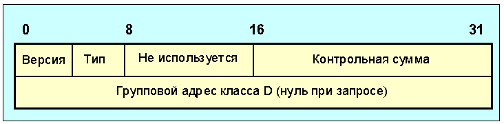
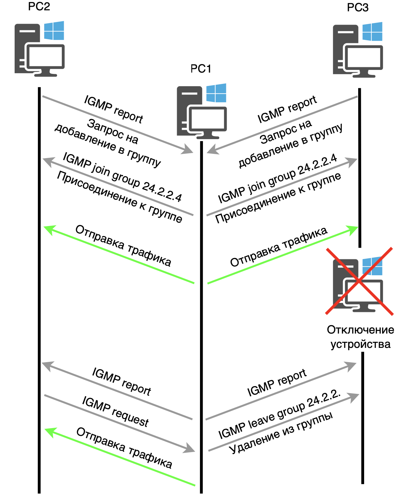

# IGMP (Internet Group Management Protocol) 

IGMP - это сетевой протокол, используемый для взаимодействия клиентов, которые принимают мультикастовый трафик. Он управляет групповыми соединениями и играет ключевую роль в организации многоадресной передачи данных, обеспечивая динамическую рассылку пакетов в сети. IGMP входит в состав пакета протоколов TCP/IP и используется для передачи данных по принципу multicast.

> Multicast - это метод передачи данных по IPv4-сетям, который позволяет отправлять один поток данных сразу большому числу получателей. В режиме multicast отправитель передает данные не одному получателю, а целой группе адресатов, что может включать как частных пользователей, так и корпоративные сети, подключенные к разным подсетям.

## Теория

Пакет IGMP идет после заголовка IPv4 и идентифицируется как протокол 2. IGMP-пакеты содержат 8-битный заголовок и данные переменного размера. Поле Type указывает на тип пакета, например, 0x11 для Membership Query, 0x16 для Membership Report и 0x17 для Leave Group. 

IGMP используется для управления членством в мультикастовых группах. Когда клиент хочет присоединиться к группе, он отправляет IGMP-пакет с запросом на членство. В пакете он указывает адрес мультикастовой группы и идентификатор. Маршрутизатор, получив этот запрос, регистрирует клиента и начинает пересылать мультикастовый трафик на соответствующее устройство. Когда клиент отключается, маршрутизатор отправляет запрос всем подключенным устройствам, и те, кто хочет продолжать получать трафик, отвечают. После получения ответов маршрутизатор обновляет свои таблицы и продолжает доставку трафика только тем, кто остался в группе. Если устройство вышло из группы, ему отправляется IGMP-пакет, сообщающий об этом.

## Практика

Когда клиент запускает подключение к multicast-группе, например, с адресом 224.2.2.4, он отправляет запрос IGMP Membership Report, указывая, что хочет получать мультикастовый трафик. Этот запрос действует только в пределах своего сетевого сегмента и не пересылается маршрутизаторами в другие сети.

После получения запроса маршрутизатор регистрирует наличие клиента за соответствующим интерфейсом и заносит информацию о нём в свою таблицу. С этого момента маршрутизатор начинает пересылать мультикастовый трафик на соответствующее устройство. Когда клиент отключается, маршрутизатор отправляет запрос всем подключенным устройствам, и те, кто хочет продолжать получать трафик, отвечают. После получения ответов маршрутизатор обновляет свои таблицы и продолжает доставку трафика только тем, кто остался в группе. Если устройство вышло из группы, ему отправляется IGMP-пакет, сообщающий об этом.

IGMP существует в трёх версиях, каждая из которых обратно совместима с предыдущими. На сегодняшний день наиболее распространены версии IGMPv2 и IGMPv3.

