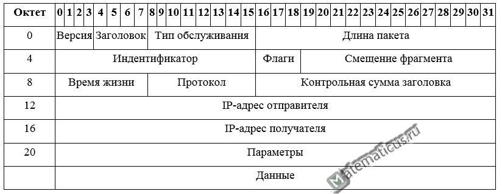

# IPv4 (Internet Protocol version 4)

IPv4 - это протокол сетевого уровня, который используется для передачи данных в интернете. Он обеспечивает уникальную идентификацию устройств в сети и маршрутизацию данных между ними. IPv4 использует 32-битные адреса, что позволяет создавать до 4,3 миллиарда уникальных адресов. Однако из-за роста числа устройств в интернете, IPv4 постепенно заменяется на IPv6, который использует 128-битные адреса и обеспечивает гораздо больше уникальных адресов. Грубо говоря он раздаёт компьютерам IP-адреса, по которым они могут общаться друг с другом. IPv4 работает поверх канального уровня и использует протоколы транспортного уровня: 

- ICMP - протокол управляющих сообщений;

- IGMP - протокол управления интернет-группами;

- TCP - протокол управления передачей;

- UDP - протокол пользовательских дейтограмм;

- SCTP - протокол управления передачей потока.

> IP-адрес - уникальный сетевой адрес узла в компьютерной сети, построенной на основе стека протоколов TCP/IP

## Теория



Пакет IPv4 состоит из заголовка и данных. Заголовок содержит информацию о версии протокола, длине заголовка, типе сервиса, общей длине пакета, идентификаторе, флагах, смещении фрагмента, времени жизни, протоколе, контрольной сумме и адресах источника и назначения. Данные могут содержать полезную нагрузку, такую как данные приложения или другой сетевой протокол.

Разберём по порядку:
1) Версия (Version) - 4 бита, указывает на версию протокола (для IPv4 это 4).
2) Заголовок (Header Length) - 4 бита, указывает на длину заголовка в 32-битных словах. Минимальная длина заголовка - 5 слов (20 байт), а максимальная - 15 слов (60 байт).
3) Тип обслуживания (Type of Service) - 8 бит, используется для указания приоритета и типа обслуживания пакета.
4) Общая длина (Total Length) - 16 бит, указывает на общую длину пакета в байтах, включая заголовок и данные. Максимальная длина пакета - 65535 байт.
5) Идентификатор (Identification) - 16 бит, используется для идентификации фрагментов одного и того же пакета при фрагментации.
6) Флаги (Flags) - 3 бита, используются для управления фрагментацией пакета. Первый бит зарезервирован, второй бит указывает, разрешена ли фрагментация, а третий бит указывает, является ли данный фрагмент последним.
7) Смещение фрагмента (Fragment Offset) - 13 бит, указывает на смещение данных в фрагменте относительно начала данных в исходном пакете. Это используется для правильной сборки фрагментов на стороне получателя.
8) Время жизни (Time to Live) - 8 бит, указывает на максимальное количество маршрутизаторов, через которые может пройти пакет, прежде чем он будет отброшен.
9) Протокол (Protocol) - 8 бит, указывает на протокол верхнего уровня, который использует данные в пакете (например, TCP, UDP, ICMP).
10) Контрольная сумма (Header Checksum) - 16 бит, используется для проверки целостности заголовка пакета.
11) Адрес источника (Source Address) - 32 бита, указывает на IP-адрес отправителя пакета.
12) Адрес назначения (Destination Address) - 32 бита, указывает на IP-адрес получателя пакета.
13) Данные (Data) - переменная длина, содержит полезную нагрузку пакета, такую как данные приложения или другой сетевой протокол. 

Максимальная длина данных зависит от общей длины пакета и длины заголовка, а длина данных - 65515 байт (65535 - 20 байт заголовка). Если данные превышают максимальную длину, пакет должен быть фрагментирован на несколько частей для передачи. При этом каждый фрагмент будет иметь свой собственный заголовок, но будет содержать идентификатор, который позволяет получателю собрать все фрагменты вместе для восстановления исходного пакета. Фрагментация может происходить на любом маршрутизаторе в пути от отправителя к получателю, если пакет превышает максимальную длину, поддерживаемую каналом связи. Получатель должен быть способен правильно обрабатывать фрагментированные пакеты и собирать их обратно в исходный пакет для дальнейшей обработки. Если пакет не может быть доставлен из-за проблем с маршрутизацией, он может быть отброшен, и отправитель может получить сообщение об ошибке ICMP (например, "Destination Unreachable"). Если пакет успешно доставлен, он будет обработан на стороне получателя в соответствии с протоколом верхнего уровня, указанным в поле "Протокол" заголовка IPv4 (например, TCP, UDP, ICMP). Получатель может использовать эту информацию для правильной обработки данных и взаимодействия с приложениями или другими сетевыми протоколами. Например, если протокол указан как TCP, получатель будет ожидать, что данные содержат сегмент TCP и будет обрабатывать его в соответствии с правилами TCP. 

IP-адреса делятся на 5 классов (A, B, C, D, E). A, B и C - это классы коммерческой адресации. D - для многоадресных рассылок, а класс E - для экспериментов.

```
Класс А: 1.0.0.0 - 126.0.0.0, маска 255.0.0.0
Класс В: 128.0.0.0 - 191.255.0.0, маска 255.255.0.0
Класс С: 192.0.0.0 - 223.255.255.0, маска 255.255.255.0
Класс D: 224.0.0.0 - 239.255.255.255, маска 255.255.255.255
Класс Е: 240.0.0.0 - 247.255.255.255, маска 255.255.255.255
```

Протокол IPv4 поддерживает три режима адресации:

- Одноадресный. 
При использовании данного режима данные передаются только на один сетевой узел, причем каждый из них может являться как отправителем, так и получателем. Поле адреса назначения содержит 32-битный IP-адрес устройства-получателя. Одноадресный режим используется чаще всего при обращении к интернет-протоколу.

- Широковещательный. 
При его использовании все устройства, подключенные к сети с множественным доступом, имеют возможность получения и обработки датаграмм, передаваемых по протоколу TCP/IPv4. Для этого поле ip-адреса назначения включает в себя специальный широковещательный код идентификации.

- Многоадресный. 
Согласно правилам обработки данных по протоколу IPv4, сюда входят адреса в диапазоне от 224.0.0.0 до 239.255.255.255. Режим объединяет два предыдущих, определяется наиболее значимой моделью 1110. В этом пакете адрес назначения содержит специальный код, который начинается с 224.x.x.x и может использоваться более чем одним узлом.

Публичные адреса назначаются публичным веб-серверам для того, чтобы человек смог попасть на этот сервер, вне зависимости от его местоположения, то есть через Интернет. Например, игровые сервера являются публичными, как и сервера Хабра и многих других веб-ресурсов.
Большое отличие частных и публичных IP адресов заключается в том, что используя частный IP адрес мы можем назначить компьютеру любой номер (главное, чтобы не было совпадающих номеров), а с публичными адресами всё не так просто. Выдача публичных адресов контролируется различными организациями.

Чтобы получить публичный IP адрес, мы обращаемся к своему интернет провайдеру, и он выдаёт нам публичный IP адрес, а он обращается к локальному Интернет регистратору (LIR - Local Internet Registry), который выдаёт пачку IP адресов нашему провайдеру, а провайдер из этой пачки выдаёт нам один адрес. Локальный Интернет регистратор не может выдать пачку адресов из неоткуда, поэтому он обращается к региональному Интернет регистратору (RIR – Regional Internet Registry). В свою очередь региональный Интернет регистратор обращается к международной некоммерческой организации IANA (Internet Assigned Numbers Authority). Контролирует действие организации IANA компания ICANN (Internet Corporation for Assigned Names and Numbers). Такой сложный процесс необходим для того, чтобы не было путаницы в публичных IP адресах.


## Практика