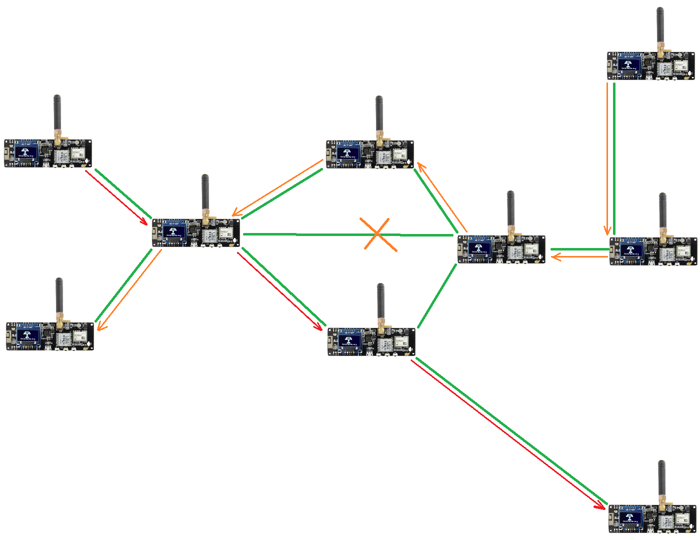
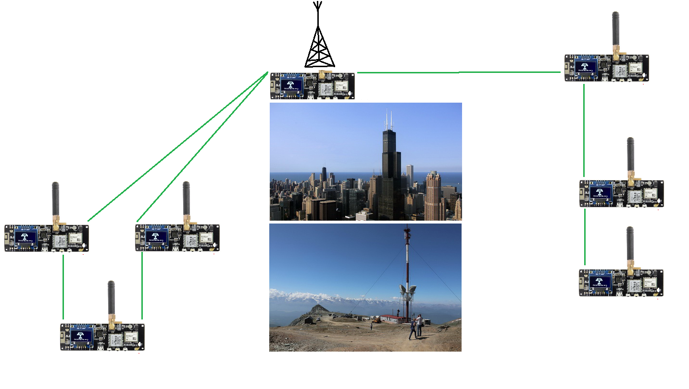

# Meshstatic

Суть в том, что что каждое устройство в группе может служить ретранслятором для других устройств группы и строить несколько альтернативных маршрутов к каждому устройству, получается очень надёжная сеть. По мере необходимости, радиомодемы автоматически создают самоорганизующуюся сеть для пересылки пакетов, поэтому каждый в группе может получать сообщения даже от самого дальнего участника, с которым нет прямой радиосвязи. Скорость передачи очень низкая, но зато надёжность очень высокая. В случае потери пакета, он будет переслан повторно. В случае потери связи с одним устройством, пакеты будут идти через другие устройства. В случае выхода из строя одного устройства, сеть продолжит работать. Задача сети проста - передать максимально далеко короткое SMS-сообщение и координаты абонента

Исходя из этого у нас есть 2 самых удобных способа использования сети Meshstatic:
1) Связь внутри небольшой локальной группы, в ней практически каждое устройство может видеть все остальные устройства и выпадение промежуточного участника из канала никак не сказывается на общей маршрутизации. Подходит для организации связи внутри небольшого коллектива, например в походе или среди небольшого жилого района

2) Связь локальных групп или отдельных удалённых абонентов возможна через высотный ретранслятор. Например, нужна экстренная связь с отдалённым районом или деревней, а сотовая связь легла. Можно связать 2 района города со своими локальными группами, но не слышавшими друг друга из-за дальности или плотной застройки. Для ретранслятора не нужно иметь отдельного устройства. Ретранслятором может выступать радиомодем, предварительно настроенный под эту функцию или любой отдельный абонент сети, живущий в выгодной геопозиции. Например, вы или ваш друг живёте на самом высоком этаже на высоком месте города или микрорайона, откуда хорошо видны близлежащие окрестности

Как уже было сказано, одна из главных проблем это дальность связи. Чем более открытая местность - тем дальше будет работать сеть. Если мы в городе то лучше всего поставить ретранслятор на крышу дома. Но тут появляется и другая проблема - хопы. Хоп это количество промежуточных устройств, через которые проходит пакет до конечного адресата. Чем больше хопов, тем дольше будет идти пакет и тем выше вероятность его потери. В дефолтной прошивке у нас предусмотрено 3 хопа, каждый прыжок добавляет в заголовке сообщения +1 и видится всеми участниками ретрансляции. Сделано это для исключения лавинообразного увеличения количества трафика в сети. Ограничение по количеству абонентов пока не актуально из-за малого количества рабочих групп и живых абонентов сети 

## Теория

В первую очередь Мешстатик это железо, так что разберём основные компоненты:

1) LoRa-модуль: Представляет собой высоко-частотный (160/433МГц) или сверх-высоко-частотный (868/915МГц) приёмно-передающий цифровой одно чиповый радио трансивер, со схемой усиления и коммутации на единой независимой печатной плате. 

2) Процессорная схема: 