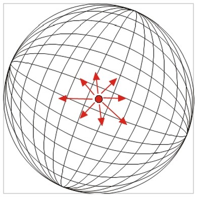
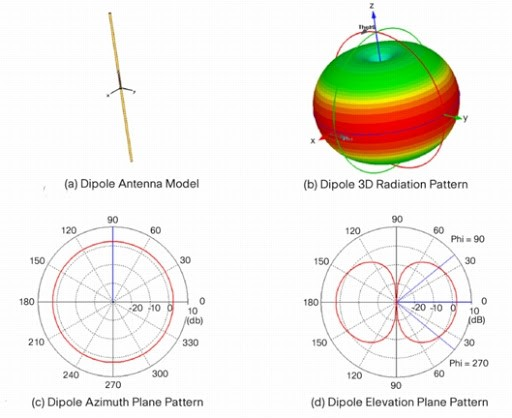
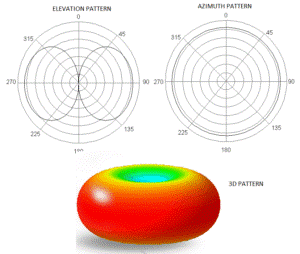
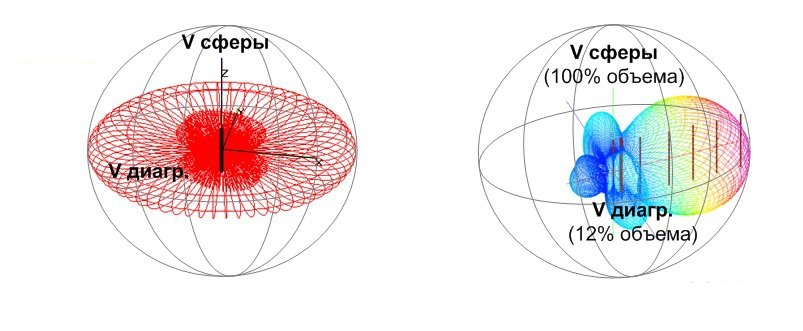
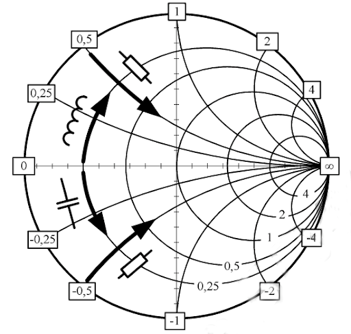
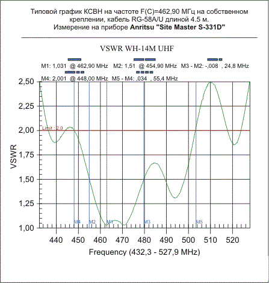
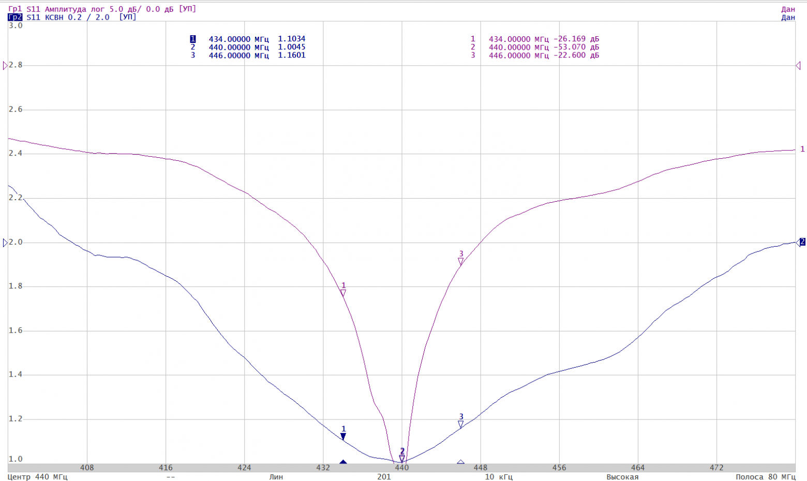
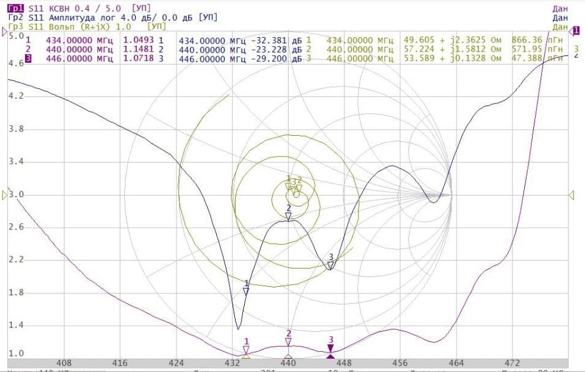

# Meshstatic

Суть в том, что что каждое устройство в группе может служить ретранслятором для других устройств группы и строить несколько альтернативных маршрутов к каждому устройству, получается очень надёжная сеть. По мере необходимости, радиомодемы автоматически создают самоорганизующуюся сеть для пересылки пакетов, поэтому каждый в группе может получать сообщения даже от самого дальнего участника, с которым нет прямой радиосвязи. Скорость передачи очень низкая, но зато надёжность очень высокая. В случае потери пакета, он будет переслан повторно. В случае потери связи с одним устройством, пакеты будут идти через другие устройства. В случае выхода из строя одного устройства, сеть продолжит работать. Задача сети проста - передать максимально далеко короткое SMS-сообщение и координаты абонента

Исходя из этого у нас есть 2 самых удобных способа использования сети Meshstatic:
1) Связь внутри небольшой локальной группы, в ней практически каждое устройство может видеть все остальные устройства и выпадение промежуточного участника из канала никак не сказывается на общей маршрутизации. Подходит для организации связи внутри небольшого коллектива, например в походе или среди небольшого жилого района


2) Связь локальных групп или отдельных удалённых абонентов возможна через высотный ретранслятор. Например, нужна экстренная связь с отдалённым районом или деревней, а сотовая связь легла. Можно связать 2 района города со своими локальными группами, но не слышавшими друг друга из-за дальности или плотной застройки. Для ретранслятора не нужно иметь отдельного устройства. Ретранслятором может выступать радиомодем, предварительно настроенный под эту функцию или любой отдельный абонент сети, живущий в выгодной геопозиции. Например, вы или ваш друг живёте на самом высоком этаже на высоком месте города или микрорайона, откуда хорошо видны близлежащие окрестности


Как уже было сказано, одна из главных проблем это дальность связи. Чем более открытая местность - тем дальше будет работать сеть. Если мы в городе то лучше всего поставить ретранслятор на крышу дома. Но тут появляется и другая проблема - хопы. Хоп это количество промежуточных устройств, через которые проходит пакет до конечного адресата. Чем больше хопов, тем дольше будет идти пакет и тем выше вероятность его потери. В дефолтной прошивке у нас предусмотрено 3 хопа, каждый прыжок добавляет в заголовке сообщения +1 и видится всеми участниками ретрансляции. Сделано это для исключения лавинообразного увеличения количества трафика в сети. Ограничение по количеству абонентов пока не актуально из-за малого количества рабочих групп и живых абонентов сети 

## Теория 

Попробуем подумать как бы выглядело сообщение, работает оно по принципу протобаф:
```c
// Эквивалент сообщения Data из protobuf
typedef struct _meshtastic_Data {
    uint32_t portnum; // ID порта приложения (например, 1 для TEXT_MESSAGE)
    pb_callback_t payload;  // Массив байт (текст сообщения)
    uint32_t id;
    bool want_response;
} meshtastic_Data;
```

Либо же 
```c
// Эквивалент сообщения MeshPacket
typedef struct _meshtastic_MeshPacket {
    uint32_t to; // ID получателя (0xFFFFFFFF - бродкаст)
    uint32_t from; // ID отправителя
    pb_callback_t encrypted;// Зашифрованные данные или сырой Data (если без шифрования)
    uint32_t id; // Случайный ID пакета
    uint32_t hop_limit; // Ограничение по прыжкам ретрансляции
} meshtastic_MeshPacket;
```

То есть что это такое, у нас есть структура сообщения, которая содержит в себе ID порта приложения (например, 1 для TEXT_MESSAGE), массив байт (текст сообщения), ID сообщения и флаг, указывающий, нужно ли ожидать ответ. Далее у нас есть структура пакета, которая содержит в себе ID получателя, ID отправителя, зашифрованные данные или сырой Data (если без шифрования), случайный ID пакета и ограничение по прыжкам ретрансляции. Что же из них двух использовать - зависит от того, что мы хотим сделать. Если мы хотим отправить текстовое сообщение, то используем Data, если же мы хотим отправить пакет, то используем MeshPacket. В любом случае, в конечном итоге, всё сводится к тому, что мы отправляем массив байт (текст сообщения) и получаем массив байт (текст ответа). 


## Практика

В первую очередь Мешстатик это железо, так что разберём основные компоненты:

1) LoRa-модуль: представляет собой высоко-частотный (160/433МГц) или сверх-высоко-частотный (868/915МГц) приёмно-передающий цифровой одно чиповый радио трансивер, со схемой усиления и коммутации на единой независимой печатной плате

2) Процессорная схема: собрана на основе современного микромощного, экономичного микроконтроллера ESP32, включающего возможность коммуникации с внешним миром по Wi-Fi и Bluetooth сетям. Через Bluetooth происходит коммуникация радиомодема с вашим смартфоном

3) Схема контроля Li-Ion батареи: в простейшем варианте схемы – это дешёвый чип контроллера-ограничителя заряда. В более продвинутом варианте – это специальный контроллер питания, управляющий потреблением электроэнергии разных компонентов схемы, следящий за напряжением на аккумуляторе, уберегающий аккумулятор от переразряда и управляющий током заряда

4) Графический OLED LCD экран: его функция – отобразить код связи при регистрации модема в смартфоне. В зависимости от сценария использования модема на нём отображается немного сервисной информации, типа короткое сообщение (цифры/английские знаки), собственные координаты и координаты с направлением до ближайшего видимого абонента сети

5) Антенна: радиоволны принимаются и передаются (!!!)

Антенны это та ещё хуйня, и там оказывается очень много нюансов, к примеру её характеристики:
- Усиление антенны
- КПД работы
- Диаграмма направленности (ДН)
- Импеданс
- Резонансная частота
- КСВ
- Согласование
- Обратные потери

> Важное примечание! Антенна – устройство реверсивное и имеет одинаковые характеристики как при приёме, так и при передаче. То есть, если говорится об усилении на приём, то это же определение верно и для передачи

1) Коэффициент усиления антенны - параметр, показывающий во сколько раз направленная антенна излучает в главном направлении сильнее, чем ненаправленная антенна, которая излучает во все стороны одинаково

> Важное примечание, термин "усиление" по отношению к параметру антенны не отражает сути параметра, он на самом деле означает "фокусировку". Антенна - это пассивный прибор и усиливать ничего не может по определению

2) Коэффициент усиления антенны, выражаемый в dBi – это усиление, выраженное в децибелах относительно антенны в виде этакого "сферического коня в вакууме", то есть изотропного бесконечно малого излучателя в вакууме, так называемый точечный источник излучения. Для нас это просто абстрактная цифра, как бы полный 0 в точке начала отсчёта усиления



3) Коэффициент усиления антенны, выражаемый в dBd – это усиление, относительно простейшей дипольной антенны. В свою очередь, соотношение усиления между идеальной изотропной антенной и идеальным полуволновым диполем составляет 2,15дБ, то есть усиление антенны 0dBd =2.15dBi, соответственно антенна с усилением 3dBd = 5.15dBi Усиление в dBd применяется обычно для описания направленных свойств антенн и некоторых других типов антенн, описание которых пока пропустим для простоты



4) КПД антенны - это отношение мощности, излучаемой антенной в свободное пространство, к мощности, подводимой к антенне. КПД антенны зависит от её конструкции и материалов, из которых она изготовлена. В идеале КПД должен быть равен 100%, но на практике он всегда меньше из-за потерь в материалах и несовершенства конструкции

5) Диаграмма направленности (ДН) антенны - это графическое изображение зависимости излучаемой мощности от направления в пространстве. ДН показывает, в каких направлениях антенна излучает сильнее, а в каких слабее. Для направленных антенн ДН имеет форму лепестков, а для всенаправленных - форму окружности. В антенной технике ДН образуется за счёт фазового сложения/вычитания волн в каждой точке пространства. Для простой вертикальной 1/4 волновой или дипольной антенны, энергия вокруг антенны распространяется по кругу, потому в вертикальной плоскости ДН получается круговой. Если рассматривать распространение радиоволн в горизонтальной плоскости, то получается восьмёрка



Для многоэлементных антенн происходит сложное многофазное переотражение от разного количества элементов – в результате которого ДН излучения/или приёма приобретают форму сложной узкой кардиоиды



(если хочется узнать больше - то [сюда](https://habr.com/ru/articles/158273/))

6) Полный импеданс и резонанс - тут всё сложно. Антенна по факту пассивный узкополосный радиотехнический элемент. Та частота, на которой антенна излучает или принимает энергию максимально эффективно, условно называют резонансной частотой. На одном геометрическом конструктиве таких частот может быть несколько, то есть эффективно антенна может излучать и принимать не на одной какой-то частоте, а на нескольких. На практике обычно используют понятие основной резонанс – он же, обычно, первый резонанс. Параметры антенн характеризуются импедансом с активной составляющей (эквивалентно обычному омическому сопротивлению, как если бы за место антенны подключили обычный резистор) и реактивной составляющей со знаком "+" - индуктивная составляющая или знак "-" - емкостная составляющая (как если бы параллельно или последовательно с резистором подключили обычный конденсатор или индуктивность) Весь диапазон активных сопротивлений от 0 до бесконечности на практике использовать не удобно, потому, мировое радиотехническое сообщество условилось использовать в большинстве случаев всего несколько фиксированных значений - в основном это 50 Ом и 75 Ом. Очень редко используются какие-то иные значения импедансов, применяемые для сильно специфичных устройств

Полный импеданс описывается на одной частоте точкой или кривой в полосе частот. Для понятного представления о характеристике полного импеданса используется "Диаграмма Смита" (это графическое изображение комплексного импеданса в полярной системе координат). На диаграмме Смита можно увидеть, как изменяется импеданс антенны с частотой и определить резонансные точки, а также согласование с передающим/принимающим устройством:



Для удобства представления, диаграмма нормируется (относительно чего она строится) к точке резонанса, где антенна (или иное устройство) имеет активное сопротивление 50 Ом – это центр диаграммы. Короткое замыкание на ней представляется в виде точки слева – 0 Ом, а обрыв в цепи – в точке справа – бесконечный импеданс

7) Коэффициент Стоячей Волны (КСВ, он же КСВН, он же SWR) и согласование антенны. Это параметр, характеризующий состояние согласования антенны с приёмно-передающим устройством, к которому антенна подключена. Если входной/выходной импеданс устройства настроен условно на 50 Ом, и настроенная в резонанс антенна имеет 50 Ом эквивалентного активного сопротивления, то рассогласование отсутствует, и вся энергия перетекает из передатчика в антенну, а затем в пространство или из пространства в антенну, а затем в приёмник без потерь. В таком случае говорят, что КСВ=1. На практике, всё что вам достаточно знать – это приемлемым уровнем рассогласования антенны при приёме является КСВ<3…4, при передаче желательно что бы  КСВ антенны не поднималось выше 2



8) Обратные потери (коэффициент отражения – reflection coefficient) - этот коэффициент показывает какое количество энергии отразилось от антенны обратно в кабель. Выражается в Децибелах с обратным знаком. Таким образом видно, при неидеальном согласовании, чем больше энергии ушло в антенну на излучение, тем меньше её отразилось обратно



Фиолетовым цветом у нас показан параметр обратных потерь, а синим цветом – КСВ антенны. Если смотреть по графику КСВ, то в полосе частот 430-450МГц антенна вроде бы работает хорошо, но по графику обратных потерь видно, что лучше всего антенна работает в довольно небольшой полосе от центральной частоты 440МГц. Ещё более показательным становится график, когда антенна сверхширокополосная, когда она имеет более-менее низкий но не постоянный уровень КСВ в очень широкой полосе, но точки идеального согласования у неё неизвестны...



(Если хочется больше прочитать и понять - то [вот](https://habr.com/ru/users/NanoVHF/articles/))