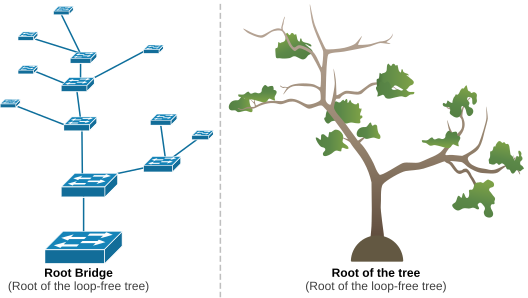

# Yggdrasil

Это зашифрованная mesh-сеть, которая работает поверх обычного интернета (или напрямую по локалке). Каждый узел получает IPv6-адрес из диапазона 200::/7, причём адрес не назначается откуда-то сверху - он вычисляется из публичного ключа узла. Это называется криптоадресация - ваш адрес - это, по сути, и есть ваш ключ (скорее наоборот, но я тут упрощаю). Подделать его нельзя - любой может проверить, что владелец адреса действительно владеет соответствующим ключом (опять упрощаю)

## Теория

Никаких центральных серверов нет. Нет реестров, нет единой точки отказа. Никто не может "выключить" сеть. Узлы сами находят друг друга и сами строят маршруты. 

> Yggdrasil часто называют наследником CJDNS - обе сети используют криптоадресацию и IPv6. Но Yggdrasil проще в настройке и использует другой подход к маршрутизации (spanning tree вместо DHT)

У нас есть сеть, в которой мы общаемся. Сеть - это узлы (ноды). Узел - любое устройство, на котором запущен Yggdrasil, то есть компьютер, сервер, телефон, роутер, Raspberry Pi (любой дноплатник). У каждого узла есть пара криптоключей и IPv6-адрес, полученный из них.

Узлы соединяются друг с другом напрямую - это пиринговые связи, в народе скорее линки. Соединение идёт по TCP или TLS через обычный интернет. Не нужно соединяться со всеми подряд - достаточно связи хотя бы с одним узлом, и через него вы получаете доступ ко всей сети.

Из всех связей между узлами автоматически строится spanning tree - остовное дерево, основа маршрутизации (подробнее будет потом).



Ещё есть multicast discovery: если несколько устройств с Yggdrasil подключены к одной локальной сети (например, к одному Wi-Fi), они найдут друг друга сами, без настройки.

Поговорим про шифрование, весь трафик в Yggdrasil зашифрован end-to-end. Это не настройка, которую нужно включать, так работает сеть. Даже если пакет пролетает через десяток чужих узлов, никто из них не может прочитать содержимое. 

Тут используются такие алгоритмы: 

1) Ed25519 - цифровые подписи. У каждого узла есть пара ключей Ed25519. Открытый ключ - это идентификатор узла, из него выводится IPv6-адрес. Подписями защищены сообщения маршрутизации
2) X25519 (Curve25519) - обмен ключами. Когда два узла начинают общаться, они через протокол Диффи-Хеллмана вырабатывают общий секрет. Ключи Ed25519 при этом конвертируются в формат Curve25519
3) NaCl box (XSalsa20 + Poly1305) - собственно шифрование. Общий секрет используется для шифрования данных (XSalsa20) с проверкой целостности (Poly1305). Если кто-то изменит хоть один бит - получатель это увидит. 
4) Forward secrecy - сессионные ключи регулярно обновляются (рэтчетинг). Даже если кто-то украдёт текущий ключ, расшифровать прошлый трафик не получится - старые ключи уже удалены.

Между непосредственными соседями соединение может дополнительно идти по TLS - это ещё один слой шифрования, защищающий служебные данные маршрутизации.

Теперь самое сложное - матшрутизация. Условно можно представить, что все узлы - это точки на карте, и мы рисуем по ним дерево, покрывающие все точки без циклов. Корень дерева выбирается автоматически - им становится узел с наибольшим ключом. Никакого голосования или центрального реестра нет. Каждый узел периодически рассылает соседям подписанное объявление типа, я существую, вот мой ключ. Соседи пересылают его дальше. Так объявления расходятся по сети, и каждый узел со временем узнаёт о существовании корня - просто потому, что его объявление выигрывает при сравнении ключей. Если корень уходит из сети, его объявления перестают обновляться, и корнем становится следующий по величине ключа узел.

У каждого узла в дереве есть координаты - последовательность чисел, описывающая путь от корня до этого узла. Каждое число - номер связи, через которую нужно пройти. Проще говоря, у каждого узла его соседи пронумерованы, и координаты - это цепочка таких номеров. Если от корня идём через связь 3, потом 1, потом 5 - координаты будут [3, 1, 5]. Координаты обновляются сами при изменении сети. Когда узел отправляет пакет, он знает координаты получателя. Дальше работает простой принцип - на каждом шаге пакет передаётся тому соседу, который ближе к получателю по координатам. Если описывать по тупому - то мы в незнакомом городе, карты нет, но есть компас и мы знаем направление. На каждом перекрёстке выбираем улицу, которая ведёт ближе к цели. Путь не всегда самый короткий, но мы точно дойдём. Для spanning tree математически доказано, что такая маршрутизация всегда доставляет пакет. Каждому узлу достаточно знать только своих соседей и их координаты - не нужно хранить карту всей сети. 

Но круто было бы как-то ускорить этот процесс. Поэтому после первого контакта Yggdrasil ищет прямой путь между узлами. Когда путь найден, пакеты идут по source route - маршрут записан прямо в заголовке пакета как список номеров связей. Каждый узел по пути просто смотрит следующий номер и пересылает пакет в нужную сторону. Как список поворотов в навигаторе. Такой путь обычно заметно короче маршрута через дерево. Но тут появляется вопрос - мы знаем адрес (то есть ключ) получателя, но как узнать его координаты? Для этого используются bloom-фильтры. Каждый узел передаёт соседям bloom-фильтр с информацией о том, какие ключи "видны" через него (его собственный и ключи узлов за ним в дереве). Когда нужно отправить пакет незнакомому ключу, узел проверяет фильтры соседей и отправляет в нужном направлении специальный запрос - path lookup. Это не сами данные, а лёгкое сообщение вида "ищу узел с таким-то ключом". Запрос передаётся по цепочке от узла к узлу (каждый следующий снова проверяет свои bloom-фильтры), пока не дойдёт до адресата. Адресат отвечает уведомлением со своими координатами и обратным маршрутом - после этого отправитель знает, куда слать данные. 

## Практика 

Разберём как поднять ноду:

1) Установить Yggdrasil. Есть пакеты для Windows, Linux (deb, rpm), macOS, Android

2) Сгенерировать конфиг:


```bash

yggdrasil -genconf > /etc/yggdrasil.conf
```

Создастся конфиг с новой парой ключей и нормальными настройками по умолчанию.

3) Добавить пиры. Можно взять парочку [публичных пиров](https://publicpeers.neilalexander.dev/) с официальной страницы. Достаточно вписать хотя бы один адрес в секцию Peers:

```yaml
Peers: [
  tls://some-public-peer.example.com:port
]
```

4) Запустить:

```bash
yggdrasil -useconffile /etc/yggdrasil.conf
```

Всё. На устройстве появится сетевой интерфейс с IPv6-адресом 200::/7. Можно пинговать другие узлы, открывать сайты в сети Yggdrasil, запускать свои сервисы. Но, лучше, конечно, запустить yggdrasil потом как сервис.