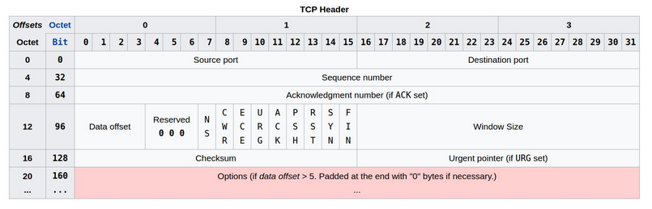
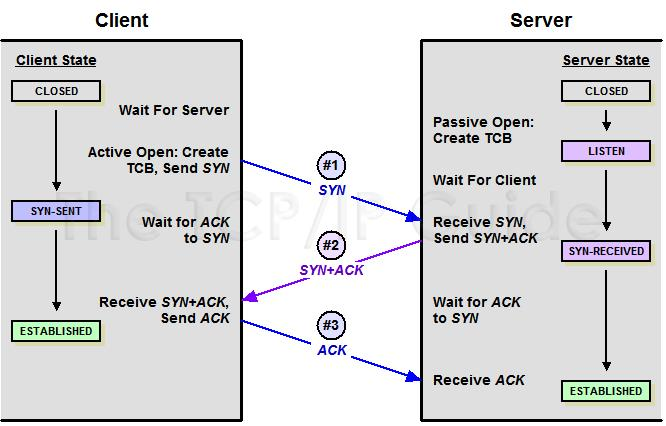
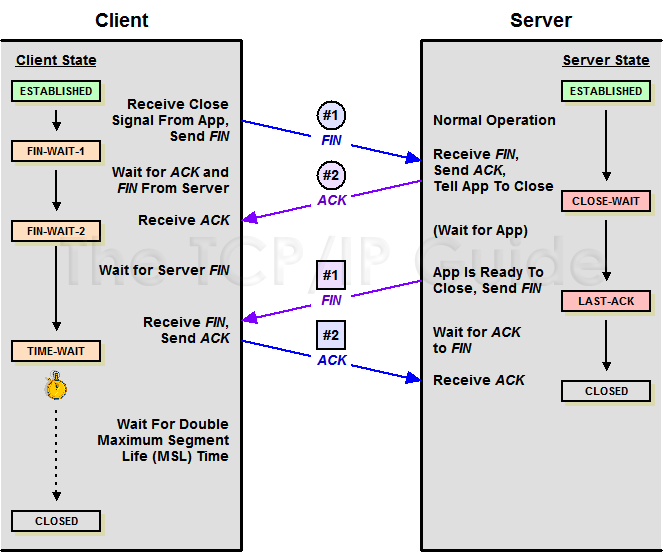

# TCP 

По факту TCP является протоколом транспортного уровня. Он позволяет осуществить соединение одного сокета (IP-адрес + порт) хоста источника с сокетом хоста назначения. Заголовок IP будет содержать информацию, связанную с IP-адресами, а заголовок TCP - информацию о порте

## Теория 

```c
#include <stdint.h>    // для uint16_t
#include <stddef.h>    // для size_t
#include <sys/types.h> // для ssize_t
#include <sys/socket.h> // для struct sockaddr и socklen_t

/*
 * TCP-флаги (приведены для справки - при использовании SOCK_STREAM
 * ядро управляет ими автоматически, нам вручную их выставлять не нужно):
 *
 *  FIN - завершение соединения (инициирует четырёхстороннее закрытие)
 *  SYN - синхронизация ISN при трёхстороннем рукопожатии
 *  RST - немедленный сброс соединения при ошибке
 *  PSH - немедленная передача данных без ожидания заполнения буфера
 *  ACK - подтверждение получения данных
 *  URG - пакет содержит срочные (out-of-band) данные
 */
#define TCP_FLAG_FIN 0x01
#define TCP_FLAG_SYN 0x02
#define TCP_FLAG_RST 0x04
#define TCP_FLAG_PSH 0x08
#define TCP_FLAG_ACK 0x10
#define TCP_FLAG_URG 0x20
```



- `Source port` - занимает 16 бит и это порт источника. То есть порт хоста, **ОТ КОТОРОГО** исходит запрос. 

- `Destination port` - тоже занимает 16 бит, и это порт назначения. То есть порт **КУДА** направляется запрос.

- `Sequence number` - тут уже занимает 32 бита и оно контроллирует порядок сообщений. Типа каждый порт поддерживает своё **уникальное число**. Когда устанавливается соединение - то генерируется число. То есть конкретное число в пределе от **0 до 2 в 32 степени**. Оно соответствует времени прошедшему после перегрузки системы отправителя (+1 за каждые 4 микросекунды) а так же +64000 за каждое новое соединение. В дальнейшем, при отправке следующих пакетов, значение порядкового номера будет увеличиваться на +1 для всех пакетов с флагом SYN, пакетов с флагом FIN и для каждого байта отправленных данных. Это позволяет принимающей системе обрабатывать пакеты в правильной последовательности, как они были сформированы при отправлении, а не в том порядке, как они были получены.

- `Acknowledgement number` - так же 32 байта занимает. Когда сообщение **содержит флаг ACK**, то значение в номере подтверждения должно соответствовать следующему порядковому номеру (SYN), которое отправитель сообщения с флагом ACK ожидает получить от передающей системы. Таким образом, отправка одного номера подтверждения способна подтвердить получение всех байтов с информацией, полученных до этого. Условно мы уточняем сколько байтом мы должны получить (АСК), и оно должно соотвествовать числу отправленных байтов (SYN). 

- `Data offset` - занимает 4 бита и это длина заголовка, известная также как смещение данных. Содержит размер заголовка TCP, измеряемый в 32-битных сегментах. Минимальный размер заголовка TCP составляет пять 32-битных сегментов (всего 20 байт), а максимальный - пятнадцать 32-битных сегмента (или 60 байт).

- `Reserved` - занимает 3 бита, которые типа зарезервированы для будущего использования, пока просто забивается нулями.

- `Flags` - занимает 9 бит и по факту это просто указатели:

    -  `NS` - 1 бит, это одноразовая сумма (Nonce Sum). Используется для улучшения работы механизма явного уведомления о перегрузке (Explicit Congestion Notification, ECN).

    - `CWR` - 1 бит и это уменьшенное окно перегрузки (Congestion Window Reduced). Данный флаг устанавливается отправителем, чтобы показать, что TCP-фрагмент был получен с установленным полем ECE. Это значит, что отправитель включил механизм уменьшения перегрузки (Congestion Control), позволяющим оптимизировать отправку пакетов с данными в перегруженных сетях, избежав серьезных задержек из-за отбрасывания пакетов. 

    - `ECE` - 1 бит и это ECN-Эхо. При установленном флаге SYN это указывает на то, что отправитель пакета поддерживает ECN. Если флаг SYN сброшен (SYN=0), а ECE установлен, то это означает, что пакет с установленным флагом CE (Congestion Experienced) был получен в заголовке IP во время обычной передачи. Таким образом, это служит индикатором перегрузки сети (или предстоящей перегрузки) для TCP-отправителя. 

    - `URG` - 1 бит. Устанавливается, если необходимо передать ссылку на поле указателя срочности (Urgent pointer).

    - `ACK` - 1 бит. Все пакеты после стартового пакета SYN будут иметь установленный флаг ACK.

    - `PSH` - 1 бит. При нормальном потоке передачи данных система получателя не будет подтверждать получение каждого пакета сразу же после его получения. Вместо этого система получателя в течении некоторого времени будет собирать и хранить полученные данные в буфере, пока не передаст их приложению пользователя. Пакет PUSH инструктирует систему получателя немедленно передать все полученные ранее данные из буфера в приложение пользователя и сразу же отправить сообщение с подтверждением.

    - `RST` - 1 бит и обозначает сброс данного соединения. Отправкой пакета RST одна из сторон сообщает о немедленном разрыве соединения. При этом соединение обрывается, а буфер очищается. Самые распространенные причины отправки пакета с установленным флагом RST - ответ на пакет, полученный для закрытого сокета или пользователь сам прервал соединение например, закрыв браузер, не дожидаясь ответа или соединение не было нормально закрыто, но находится в неактивном состоянии некоторое время.

    - `SYN` - 1 бит. Начинает соединение и синхронизирует порядковые номера. Первый пакет, отправленный с каждой стороны, должен в обязательном порядке иметь установленным этот флаг.

    - `FIN` - 1 бит. Одна из конечных точек отправляет пакет с установленным флагом FIN для другой конечной точки, чтобы сообщить, что все пакеты были отправлены, и соединение пора завершить.

- `Window size` - весит 16 бит и это размер окна приема. В нем указывается количество байт данных, считая от последнего номера подтверждения, которые готов принять отправитель данного пакета. Другими словами, отправитель данного пакета в этом поле сообщает другой стороне, каким доступным размером буфера приема данных он располагает.

- `Checksum` - тоже весит 16 бит. Используется для проверки ошибок при передаче и/или приеме отправленного пакета. Рассчитывается с учетом заголовка (все поля заголовка, кроме самой контрольной суммы), полезной нагрузки (неслужебные данные с полезной информацией которая передается), а также псевдо-заголовка (IP-адрес источника, IP-адрес назначения, номер протокола и длина TCP-сегмента, в которой учитывается как длина полей заголовка, так и длина данных полезной нагрузки). 

- `Urgent pointer` - весит 16 бит и это указатель срочности. Если установлен флаг URG, то он указывает с какого байта начинаются срочные данные. После получения TCP-сегмента с флагом URG, установленным в значение 1, приемное устройство смотрит на поле указателя срочности и по его значению определяет, какие данные в сегменте являются срочными. Затем эти срочные данные сразу же направляются в приложение пользователя с указанием того, что отправитель пометил данные как срочные. Остальные данные в данном сегменте обрабатываются в нормальном режиме. Этим принцип обработки в сообщении флага URG отличается от обработки флага PSH, при получении которого вся информация из буфера, а не только срочная из сообщения, немедленно передается в приложение пользователя. 

## Процесс 

- Установка соединения 

Установка соединения осуществляется с помощью, так называемого трехстороннего рукопожатия TCP. Инициатором соединения может выступать любая сторона, то есть и сервер может попросить соединение и наоборот - клиент. Вот снизу трёхстороннее рукопожатие!



То есть сначала мы создаем сокет, вот как-то так:

```c
// Создаёт TCP-сокет (SOCK_STREAM) без привязки к порту
// SOCK_STREAM - потоковый сокет: данные передаются надёжно, в порядке отправки,
// без потерь и дублирования. Ядро само управляет SYN/ACK, повторами и окном
int tcp_socket(void) {
    int s = socket(AF_INET, SOCK_STREAM, 0);
    if (s < 0) {
        perror("tcp_socket: socket");
        return -1;
    }

    // SO_REUSEADDR позволяет повторно занять порт сразу после закрытия сокета,
    // что удобно при частом перезапуске сервера во время разработки
    int opt = 1;
    setsockopt(s, SOL_SOCKET, SO_REUSEADDR, &opt, sizeof(opt));

    return s;
}
```

Потом мы занимаем этот сокет:

```c
int tcp_socket_bind(uint16_t port) {
    int s = tcp_socket();
    if (s < 0) {
        return -1;
    }

    struct sockaddr_in addr; // структура для хранения адреса (IP + порт)
    memset(&addr, 0, sizeof(addr)); // обнуляем структуру перед заполнением
    addr.sin_family      = AF_INET; // семейство адресов - IPv4
    addr.sin_addr.s_addr = htonl(INADDR_ANY); // принимаем соединения на всех сетевых интерфейсах
    addr.sin_port        = htons(port); // порт в сетевом порядке байт (big-endian)

    // Привязываем сокет к адресу и порту а если порт уже занят, bind() вернёт ошибку
    if (bind(s, (struct sockaddr *) & addr, sizeof(addr)) < 0) {
        perror("tcp_socket_bind: bind");
        close(s);
        return -1;
    }

    return s;
}
```

Ну а дальше мы должны создать место, куда можем слать наши пакеты, то есть обозначаем наш сервер: 
```c
// Переводит сокет в пассивный режим: сокет начинает принимать входящие соединения
// backlog - размер очереди полностью установленных соединений, ожидающих accept()
int tcp_listen(int sockfd, int backlog) {
    if (listen(sockfd, backlog) < 0) {
        perror("tcp_listen: listen");
        return -1;
    }
    return 0;
}
```
Мы создали место куда нужно кидать - и теперь нам нужно создать то, что кидать!
```c
struct sockaddr_in serv;
memset(&serv, 0, sizeof(serv));
serv.sin_family = AF_INET;
serv.sin_port   = htons(server_port);
inet_pton(AF_INET, server_ip, &serv.sin_addr);

// tcp_connect() вызывает системный connect()
// Ядро само выполнит трёхстороннее рукопожатие:
//   клиент  ->  SYN           ->  сервер
//   клиент  <-  SYN-ACK       <-  сервер
//   клиент  ->  ACK           ->  сервер
// После возврата из connect() соединение уже установлено
if (tcp_connect(s, (struct sockaddr *)&serv, sizeof(serv)) < 0) {
    printf("Connection failed.\n");
    close(s);
    return 1;
}
```

1) Полетел Пакет1. Клиент отправляет пакет с установленным флагом SYN и случайным числом (R1), включенным в поле порядкового номера (sequence number). 

Получается, что мы что-то бросили в выделенное ранее место и теперь хотим узнать - долетело-ли оно:

```c
// listen() переводит сокет в пассивный режим
// Ядро будет принимать входящие SYN и завершать рукопожатие самостоятельно,
// складывая готовые соединения в очередь (backlog = 5)
if (tcp_listen(s, 5) < 0) {
    close(s);
    return 1;
}
```

2) Полетел Пакет2. При получении Пакета 1 - сервер в ответ отправляет пакет с установленным флагом SYN, а также с установленным флагом ACK. Поле порядкового номера будет содержать новое случайное число (R2), а поле номера подтверждения будет содержать значение порядкового номера клиента, увеличенного на единицу (то есть R1 + 1). Таким образом, он будет соответствовать следующему порядковому номеру, который сервер ожидает получить от клиента.

3) В ответ на пакет SYN от сервера (Пакет 2) клиент отправляет пакет с установленным флагом ACK и полем номера подтверждения с числом R2 + 1. По аналогии, это число будет соответствовать следующему порядковому номеру, который клиент ожидает получить от сервера.

**Чтобы не сбить никого с толку - то, что кода мало и вы не видите взаимодейстия трёх сторон - это нормально! Напомню, что:**
```c
//   клиент  ->  SYN           ->  сервер
//   клиент  <-  SYN-ACK       <-  сервер
//   клиент  ->  ACK           ->  сервер
```
**Просто мы пользуемся уже готовой системной функции, которая это всё проворачивает. То есть серверный `listen` и клиентский `connect` всё таки делают эти 3 пересылки как на схеме и как описано в пунктах 1, 2 и 3 - просто в коде это покрыто лишь 2 функциями. Может быть, когда я буду поумнее - я попробую самостоятельно реализовать и такие низкоуровневые вещи.**

Окончательно сервер принимает соединение вот тут:
```c
char host[INET_ADDRSTRLEN];
inet_ntop(AF_INET, &client.sin_addr, host, sizeof(host));
printf("Accepted connection from %s:%u\n", host, ntohs(client.sin_port));
```

4) Далее идёт загрузка данных. После инициализации соединения дата будет перемещаться в обоих направлениях TCP-соединения. Все пакеты в обязательном порядке будут содержать установленный флаг ACK. Другие флаги, такие как, например, PSH или URG, могут быть, а могут и не быть установленными.

    - То есть со стороны клиента отправка сообщения выглядит так
    ```c
    // Отправляем данные - ядро разобьёт их на TCP-сегменты,
    // добавит заголовки, порядковые номера и будет следить за доставкой
    const char *msg = "Hello from TCP client!\n";
    if (tcp_send(s, msg, strlen(msg)) < 0) {
        printf("Send failed.\n");
        close(s);
        return 1;
    }
    ``` 
    - Сервер же в это время готовиться принять сообщение 
    ```c
    // Читаем данные от клиента.
    char    buf[256];
    ssize_t n = tcp_recv(conn, buf, sizeof(buf) - 1);
    if (n > 0) {
        buf[n] = '\0';
        printf("Received: %s", buf);

        // Отправляем ответ.
        const char *reply = "Hello from TCP server!\n";
        tcp_send(conn, reply, strlen(reply));
    }
    ```
    - И клиент уже после этого готовиться послушать что ему сказал сервер: 
    ```c
    // Читаем ответ сервера
    char    buf[256];
    ssize_t n = tcp_recv(s, buf, sizeof(buf) - 1);
    if (n > 0) {
        buf[n] = '\0';
        printf("Server replied: %s", buf);
    } else if (n == 0) {
        printf("Server closed the connection.\n");
    }
    ```



**Опять же, в коде всё выглядит довольно просто, но в реальности завершение очень сложный процесс - и он показан на фото и описан ниже, так же показываю и сам код:**
Вот со стороны клиента:
```c
// close() инициирует четырёхстороннее закрытие:
    //   клиент - FIN - сервер
    //   клиент - ACK - сервер
    //   клиент - FIN - сервер
    //   клиент - ACK - сервер
    close(s);
```

5) Завершение соединения. При нормальном завершении TCP-соединения мы используем двухстороннее рукопожатие, каждая сторона закрывает свой конец виртуального канала и освобождает все задействованные ресурсы. Со стороны устройства отправляется сообщение с установленным флагом FIN (что этот пакет не обязательно должен быть пустым, он также может содержать полезную нагрузку), чтобы сообщить другому устройству о своем желании завершить открытое соединение. Затем получение этого сообщения подтверждается (сообщение от отвечающего устройства с установленным флагом ACK, говорящем о получении сообщения FIN). Когда отвечающее устройство готово, оно также отправляет сообщение с установленным флагом FIN, и после получения в ответ подтверждающего получение сообщения с установленным флагом ACK или ожидания определенного периода времени, предусмотренного для получения ACK, сеанс полностью закрывается. Состояния, через которые проходят два соединенных устройства во время обычного завершения соединения, отличаются, потому что устройство, инициирующее завершение сеанса, ведет себя несколько иначе, чем устройство, которое получает запрос на завершение. В частности, TCP на устройстве, получающем начальный запрос на завершение, должен сразу информировать об этом процесс своего приложения и дождаться от него сигнала о том, что приложение готово к этой процедуре. Инициирующему устройству не нужно это делать, поскольку именно приложение и выступило инициатором. 

---

Чтобы прочитать больше или разобраться ещё лучше - надо почитать [этот сайт](http://www.tcpipguide.com/index.htm)

**Как собрать и запустить пример из папки `TransportLayer/TCP/echo_server/C`**
```bash
cd TransportLayer/TCP/echo_server/C
gcc -I../.. ../../tcp.c client.c -o tcp_client
gcc -I../.. ../../tcp.c server.c -o tcp_server

# В одном терминале запустить сервер:
./tcp_server
# В другом - клиента:
./tcp_client
```