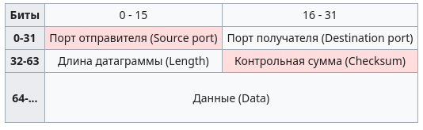
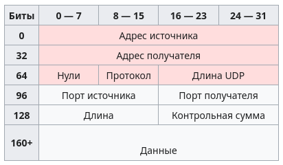
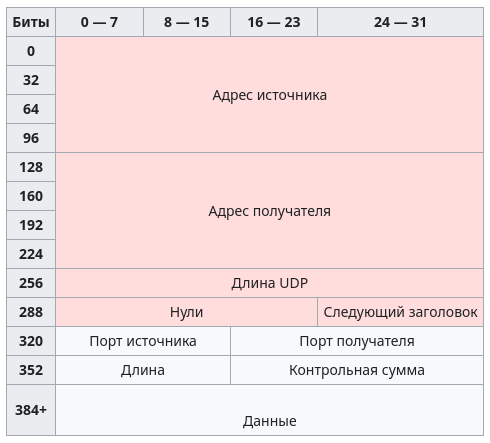

# UDP

UDP это протокол который не требует подтверждения(рукопожатия). Датаграммы могут прийти не по порядку, дублироваться или вовсе исчезнуть без следа, но гарантируется, что если они придут, то в целостном состоянии. UDP-приложения используют датаграммные сокеты для установки соединения между хостами

## Теория

 Приложение связывает сокет с его конечной точкой передачи данных, которая является комбинацией IP-адреса и порта службы. Порт - это программная структура, определяемая номером порта - 16-битным целочисленным значением (то есть от 0 до 65 535). Порт 0 зарезервирован, хотя и является допустимым значением порта источника в случае, если процесс-отправитель не ожидает ответных сообщений.

IANA разбила номера портов на три группы.

- Порты с номерами от **0 до 1023** используются для обычных, хорошо известных **служб**. В Unix-подобных операционных системах для использования таких портов необходимо разрешение суперпользователя.
- Порты с номерами от **1024 до 49 151** предназначены для зарегистрированных **IANA служб**.
- Порты с **49 152 по 65 535** могут быть использованы для **любых целей**, поскольку официально не разработаны для какой-то определённой службы. Они также используются как динамические (временные) порты, которые запущенное на хосте программное обеспечение может случайным образом выбрать для самоопределения. По сути, они используются как временные порты в основном клиентами при связи с серверами.

Заголовок UDP состоит из четырёх полей, каждое по 2 байта (16 бит). Два из них необязательны к использованию в IPv4 (розовые ячейки в таблице), в то время как в IPv6 необязателен только порт отправителя!



- `Source port` - в этом поле указывается номер порта **отправителя**. По логике это значение задаёт порт, на который при необходимости будет посылаться ответ. В противном же случае значение должно быть равным 0. Если хостом-источником является клиент, то номер порта будет, скорее всего, динамическим (49 152 - 65 535). Если источником является сервер, то его порт будет одним из "хорошо известных" (0 - 1023). 

- `Destination port` - это поле содержит порт получателя. Аналогично порту отправителя, если хостом-получателем является клиент, то номер порта динамический, если получатель — сервер, то это будет "хорошо известный" порт.

- `Length` - это поле задаёт длину всей датаграммы (заголовка и данных) в байтах. Минимальная длина равна длине заголовка - 8 байт. Теоретически, максимальный размер поля - 65 535 байт для UDP-датаграммы (8 байт на заголовок и 65 527 на данные). Фактический предел для длины данных при использовании IPv4 - 65 507 (помимо 8 байт на UDP-заголовок требуется ещё 20 на IP-заголовок). 

_Но нужно понимать, что если длина IPv4 пакета с UDP будет превышать MTU (для Ethernet по умолчанию 1500 байт), то пакет будет разбит на меньшие пакеты или вообще не будет доставлен, если промежуточные маршрутизаторы или конечный хост не будут поддерживать фрагментированные IP пакеты. Также в RFC 791 указывается минимальная длина IP пакета 576 байт, которую должны поддерживать все участники IPv4, и рекомендуется отправлять IP пакеты большего размера только в том случае если вы уверены, что принимающая сторона может принять пакеты такого размера. Так что, чтобы избежать фрагментации UDP пакетов (и возможной их потери), размер данных в UDP не должен превышать: MTU - (Max IP Header Size) - (UDP Header Size) = 1500 - 60 - 8 = 1432 байта. Для того чтобы быть уверенным, что пакет будет принят любым хостом, размер данных в UDP не должен превышать: (минимальная длина IP пакета) - (Max IP Header Size) - (UDP Header Size) = 576 - 60 - 8 = 508 байт._

_В Jumbogram’мах IPv6 пакеты UDP могут иметь больший размер. Максимальное значение составляет 4 294 967 295 байт (232 - 1), из которых 8 байт соответствуют заголовку, а остальные 4 294 967 287 байт - данным._

_Так же надо помнить, что большинство современных сетевых устройств отправляют и принимают пакеты IPv4 длиной до 10000 байт без их разделения на отдельные пакеты. Тем не менее, "Jumbo-пакеты" поддерживают не все устройства и перед организацией связи с помощью UDP/IP IPv4 посылок с длиной, превышающей 1500 байт, нужно проверять пройдёт ли оно физически или нет._

- `Checksum` - это поле контрольной суммы используется для проверки заголовка и данных на ошибки. Если сумма не сгенерирована передатчиком, то поле заполняется нулями. Поле не является обязательным для IPv4. Она считается примерно так: перед расчётом контрольной суммы, если длина UDP-сообщения в байтах нечётна, то UDP-сообщение дополняется в конце нулевым байтом (псевдозаголовок и добавочный нулевой байт не отправляются вместе с сообщением, они используются только при расчёте контрольной суммы). Поле контрольной суммы в UDP-заголовке во время расчёта контрольной суммы принимается нулевым. Для расчёта контрольной суммы псевдозаголовок и UDP-сообщение разбивается на двухбайтные слова. Затем рассчитывается сумма всех слов в арифметике обратного кода (то есть кода, в котором отрицательное число получается из положительного инверсией всех разрядов числа и существует два нуля: 0х0000 (обозначается +0) и 0xffff(обозначается −0)). Результат записывается в соответствующее поле в UDP-заголовке. Значение контрольной суммы, равное 0х0000 (+0 в обратном коде), зарезервировано и означает, что для посылки контрольная сумма не вычислялась. В случае, если контрольная сумма вычислялась и получилась равной 0х0000, то в поле контрольной суммы заносят значение 0xffff(-0 в обратном коде). При получении сообщения получатель считает контрольную сумму заново (уже учитывая поле контрольной суммы), и, если в результате получится −0 (то есть 0xffff), то контрольная сумма считается сошедшейся. Если сумма не сходится (данные были повреждены при передаче, либо контрольная сумма неверно посчитана на передающей стороне), то решение о дальнейших действиях принимает принимающая сторона. Как правило имеются настройки, позволяющие либо игнорировать такие пакеты, либо пропускать их на дальнейшую обработку, невзирая на неправильность контрольной суммы. 

## Псевдозаголовки

- IPv4


Если UDP работает над IPv4, контрольная сумма вычисляется при помощи псевдозаголовка, который содержит информацию из заголовка IPv4. Псевдозаголовок не является настоящим IPv4-заголовком, используемым для отправления IP-пакета. В таблице приведён псевдозаголовок, используемый только для вычисления контрольной суммы. Адреса источника и получателя берутся из IPv4-заголовка. Значения поля "Протокол" для UDP равно 17 (0x11). Поле "Длина UDP" соответствует длине заголовка и данных. Вычисление контрольной суммы для IPv4 необязательно - если она не используется, то значение равно 0. 

- IPv6
При работе UDP над IPv6 контрольная сумма обязательна. При вычислении контрольной суммы опять используется псевдозаголовок, имитирующий реальный IPv6-заголовок. 



Адрес источника такой же, как и в IPv6-заголовке. Адрес получателя - финальный получатель; если в IPv6-пакете не содержится заголовка маршрутизации (Routing), то это будет адрес получателя из IPv6-заголовка, в противном случае, на начальном узле, это будет адрес последнего элемента заголовка маршрутизации, а на узле-получателе - адрес получателя из IPv6-заголовка. Значение "Следующий заголовок" равно значению протокола - 17 для UDP. Длина UDP - длина UDP-заголовка и данных.

## Процесс 

- Занятие сокета

Тут у нас нет никакого трёхстороннего рукопожатия, мы создаем "место" в которое можно кидать любые вещи и надеятся, что они долетят.

```c
// понтовая реализация UDP-сокетов с поддержкой флагов для многопроцессных серверов и автоматического закрытия при execve
int udp_socket_flags(int flags)
{
    // Создаем UDP-сокет, используя IPv4 (AF_INET) и тип SOCK_DGRAM для UDP, протокол 0 (автоматический выбор для UDP)
    int s = socket(AF_INET, SOCK_DGRAM, 0);
    if (s < 0) {
        perror("udp_socket: socket");
        return -1;
    }

    // Устанавливаем SO_REUSEPORT, если поддерживается, чтобы несколько сокетов могли привязываться к одному порту
    //  и распределять входящие соединения между ними, что полезно для многопроцессных серверов
    if (flags & UDP_FLAG_REUSEPORT) {
    #ifdef SO_REUSEPORT
        int opt = 1;
        if (setsockopt(s, SOL_SOCKET, SO_REUSEPORT, &opt, sizeof(opt)) < 0) {
            perror("udp_socket: setsockopt SO_REUSEPORT");
        }
    #else
        fprintf(stderr, "udp_socket: SO_REUSEPORT not supported on this platform\n");
    #endif
    }

    // Устанавливаем SO_REUSEADDR, если указано, чтобы несколько сокетов могли привязываться к одному порту, 
    // что полезно для многопроцессных серверов
    if (flags & UDP_FLAG_CLOEXEC) {
        // тут вызываем fcntl для установки флага FD_CLOEXEC, чтобы сокет автоматически закрывался при выполнении execve,
        // что полезно для предотвращения утечек дескрипторов в дочерних процессах
        int fdflags = fcntl(s, F_GETFD);
        if (fdflags < 0) {
            perror("udp_socket: fcntl F_GETFD");
        } else {
            if (fcntl(s, F_SETFD, fdflags | FD_CLOEXEC) < 0) {
                perror("udp_socket: fcntl F_SETFD FD_CLOEXEC");
            }
        }
    }

    return s;
}
```

Дальше как создали - занимаем этот сокет:

```c
// Создает UDP-сокет с указанными флагами и привязывает его к указанному порту
int udp_socket_bind_flags(uint16_t port, int flags)
{
    // Сначала создаем сокет с нужными флагами, а затем привязываем его к порту
    int s = udp_socket_flags(flags);
    if (s < 0) {
        return -1;
    }

    // структура sockaddr_in используется для указания адреса и порта, к которому мы хотим привязать сокет
    struct sockaddr_in addr;
    memset(&addr, 0, sizeof(addr)); // выделили место
    addr.sin_family = AF_INET; // используем IPv4
    addr.sin_addr.s_addr = INADDR_ANY; // привязываем к любому доступному интерфейсу 
    addr.sin_port = htons(port); // преобразуем порт в сетевой порядок байтов (big-endian)

    // занимаем порт, чтобы сервер мог принимать данные от клиентов, отправленных на этот порт
    if (bind(s, (struct sockaddr *) &addr, sizeof(addr)) < 0) {
        perror("udp_socket_bind: bind");
        close(s);
        return -1;
    }

    // если все прошло успешно, возвращаем дескриптор сокета
    return s;
}

// Создает UDP-сокет и привязывает его к указанному порту
int udp_socket_bind(uint16_t port)
{
    return udp_socket_bind_flags(port, UDP_FLAG_REUSEADDR);
}
```

А теперь - у нас есть лишь 2 функции, прочитать и отправить. То есть даже на этом моменте, после прочтения о TCP, понятно что UDP намного менее "стабилен", зато меньше пишем кода!

```c
ssize_t udp_sendto(int sockfd, const void *data, size_t len, const struct sockaddr *destaddr, socklen_t addrlen)
{
    // отправляем данные по UDP-сокету на указанный адрес назначения, используя функцию sendto, 
    // которая позволяет указать адрес получателя для каждого отправляемого сообщения
    ssize_t sent = sendto(sockfd, data, len, 0, destaddr, addrlen);
    if (sent < 0) {
        perror("udp_sendto: sendto");
    }
    // возвращаем количество отправленных байт или -1 в случае ошибки
    return sent;
}

ssize_t udp_recvfrom(int sockfd, void *data, size_t len, struct sockaddr *srcaddr, socklen_t *addrlen)
{
    // получаем данные по UDP-сокету, используя функцию recvfrom, 
    // которая позволяет получить адрес отправителя для каждого полученного сообщения
    ssize_t received = recvfrom(sockfd, data, len, 0, srcaddr, addrlen);
    if (received < 0) {
        perror("udp_recvfrom: recvfrom");
    }
    // возвращаем количество полученных байт или -1 в случае ошибки
    return received;
}
```

На стороне сервера и клиента всё так же довольно просто: 

1) Создаём место где будем общаться, то есть сокет

```c
// Создаем UDP-сокет и привязываем его к порту
int sockfd = udp_socket_bind(port);
if (sockfd < 0) {
    fprintf(stderr, "Failed to create and bind UDP socket.\n");
    return EXIT_FAILURE;
}
```

То есть теперь мы уже слушаем друг друга!

2) Теперь нам нужно создать место, где мы будем записывать ответы друг друга:

```c
struct sockaddr_in server_addr;
memset(&server_addr, 0, sizeof(server_addr));
server_addr.sin_family = AF_INET;
server_addr.sin_port = htons(port);
```

3) Дальше остаётся лишь начать общаться:

Клиент кидает серверу: 
```c
ssize_t sent_bytes = udp_sendto(sockfd, message, strlen(message), (struct sockaddr *)&server_addr, sizeof(server_addr));
```

На что сервер слушает: 
```c
ssize_t recv_bytes = udp_recvfrom(sockfd, buffer, sizeof(buffer) - 1, (struct sockaddr *)&client_addr, &client_addr_len);
```
- Занятие сокета: создаём `SOCK_DGRAM` и биндим порт (как в примере выше).

- Connected UDP

    `connect()` для UDP не устанавливает сессию — оно просто фиксирует адрес пира. После `connect()` можно использовать `send()`/`recv()` без передачи адреса, и ядро будет отбрасывать пакеты не от этого пира.

```c
struct sockaddr_in peer = { .sin_family = AF_INET, .sin_port = htons(12345) };
inet_pton(AF_INET, "10.0.0.1", &peer.sin_addr);
connect(sock, (struct sockaddr*)&peer, sizeof(peer));
send(sock, buf, len, 0);
recv(sock, buf, sizeof(buf), 0);
```

- Атомарность и усечение

    UDP гарантирует целостность датаграммы, но при чтении приложение может получить усечённые данные, если буфер меньше датаграммы. Для детекции усечения используйте `recvmsg()` с флагом `MSG_TRUNC`.

```c
struct msghdr mh = { .msg_iov = &iov, .msg_iovlen = 1 };
ssize_t n = recvmsg(sock, &mh, 0);
if (mh.msg_flags & MSG_TRUNC) {
        // датаграмма была усечена
}
```

- Размеры и фрагментация

    Фрагментация — задача IP: если datagram > MTU и DF=0, IP разобьёт её на фрагменты. Потеря одного фрагмента — потеря всей датаграммы. Практическое правило: Ethernet MTU=1500 → безопасная полезная нагрузка ≈ 1432 байта; для максимальной совместимости ориентируйтесь на ≈508 байт или используйте PMTUD.

- Контрольная сумма

    В IPv4 UDP-checksum опционален (0 = не считали), но рекомендуется. В IPv6 — обязательна. При расчёте участвует псевдо‑заголовок (адреса, протокол, длина).

- Блокировка / таймауты

    Установить таймаут приёма: `setsockopt(sock, SOL_SOCKET, SO_RCVTIMEO, &tv, sizeof(tv))`.
    Неблокирующий режим: `fcntl(sock, F_SETFL, O_NONBLOCK)` — `recvfrom()` вернёт -1 и `errno=EAGAIN`/`EWOULDBLOCK`.

- sendto()/recvfrom() — поведение и ошибки

    Возвращают число байт или -1. Частые errno: `EMSGSIZE` (слишком большой пакет), `ENETUNREACH`, `EHOSTUNREACH`, асинхронный `ECONNREFUSED` (ICMP "port unreachable"). На `EMSGSIZE` — уменьшить пакет; на сетевые ошибки — логировать/бэкофф.

- Broadcast и Multicast

    Для широковещания включите `SO_BROADCAST`. Для мультикаста используйте `IP_ADD_MEMBERSHIP` / `IPV6_JOIN_GROUP`. Управляйте TTL (`IP_MULTICAST_TTL`) и локальным echo (`IP_MULTICAST_LOOP`).

```c
int on = 1; setsockopt(sock, SOL_SOCKET, SO_BROADCAST, &on, sizeof(on));
// multicast: struct ip_mreq m; m.imr_multiaddr.s_addr = inet_addr("224.0.0.1");
// setsockopt(sock, IPPROTO_IP, IP_ADD_MEMBERSHIP, &m, sizeof(m));
```

- Port reuse

    `SO_REUSEADDR` помогает при повторном биндинге (TIME_WAIT и т.п.). `SO_REUSEPORT` позволяет нескольким процессам/потокам биндинг на один порт для балансировки — поведение ОС-зависимо.

- Performance APIs

    Для высокой нагрузки используйте `sendmmsg()`/`recvmmsg()` (батчи) и флаг `MSG_WAITFORONE` для `recvmmsg()`.

- ICMP и асинхронные ошибки

    ICMP-ошибки приходят асинхронно и иногда проявляются как `errno` на последующих вызовах. Не полагайтесь на них полностью — маршрутизаторы могут фильтровать ICMP.

- NAT / безопасность

    NAT меняет исходные ephemeral-порты — для traversal нужны STUN/ICE/UPnP. UDP легко подделать — проверяйте `recvfrom()`-адрес, используйте HMAC/DTLS для защиты и аутентификации.
--- 

**Как собрать и запустить примеры из папки `TransportLayer/UDP/___/C`**
```bash
cd TransportLayer/UDP/___/C
gcc -I../.. udp.c client.c -o udp_client
gcc -I../.. udp.c server.c -o udp_server

# В одном терминале запустить сервер:
./udp_server
# В другом - клиента:
./udp_client
```

**Как собрать и запустить примеры из папки `TransportLayer/UDP/___/Go`**
```bash
# В одном терминале запустить сервер:
cd TransportLayer/UDP/___/Go/server
go run server.go
# В другом - клиента:
cd TransportLayer/UDP/___/Go/client
go run client.go
```

**Как собрать и запустить примеры из папки `TransportLayer/UDP/___/Rust`**
```bash
# Cначала сбилдить
cd TransportLayer/UDP/___/Rust
cargo build

# В одном терминале запустить сервер:
./target/debug/server
# В другом - клиента:
./target/debug/client
```

**Как собрать и запустить примеры из папки `TransportLayer/UDP/___/C++`**
```bash
# Cначала сбилдить
cd TransportLayer/UDP/___/C++
g++ -std=c++17 -O2 server.cpp -o server -lboost_system -lpthread
g++ -std=c++17 -O2 client.cpp -o client -lboost_system -lpthread

# В одном терминале запустить сервер:
./server
# В другом - клиента:
./client
```

**Как собрать и запустить примеры из папки `TransportLayer/UDP/___/Zig`**
```bash
# Сначала сбилдим
cd TransportLayer/UDP/___/Zig
zig build-exe server.zig
zig build-exe client.zig

# В одном терминале запустить сервер:
./server
# В другом - клиента:
./client
```